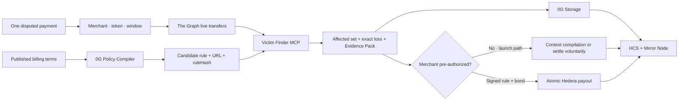
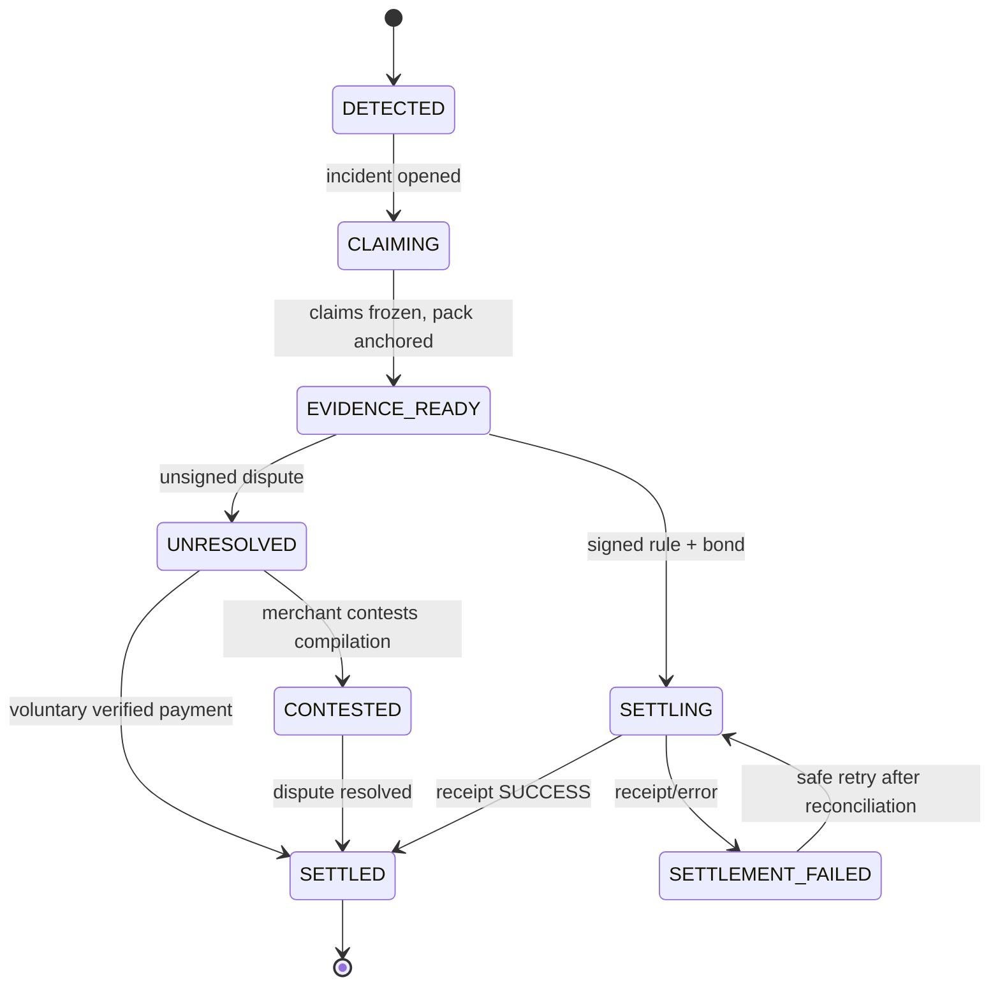

# BITEBACK — Hackathon Blueprint

> **When protocols bite, wallets bite back.**

**Evento:** ETHGlobal Lisbon 2026 · **Deadline:** domingo, 26 julho, 09:00 WEST

**Revisão final:** 25 julho 2026 · **feature freeze: apenas validação**

**Parceiros:** **The Graph · Hedera · 0G**

**Categoria:** Autonomous collective redress for on-chain users

**Implementação:** TypeScript · testnets · **sem Solidity, em lado nenhum**

**Estado:** narrativa final e registo técnico. O `README.md` separa claramente
produto inicial, expansão e implementação live.

## Convenções

- **P0** — necessário para submeter. **P1** — melhora muito. **P2** — só depois do freeze.
- **DoD** — Definition of Done. 🔴 — bloqueante ou risco ativo.
- Nunca apresentar dados mockados como live.
- Nunca deixar um LLM decidir factos, elegibilidade, montantes ou destinatários.

---

## 1. Resumo executivo

### Problema

Quando um serviço cobra fora da política que publicou, cada utilizador tem de
descobrir o problema, reunir provas e perseguir o protocolo sozinho. Do outro
lado, o protocolo recebe tickets fragmentados e repete a investigação, a
reconciliação, o cálculo do prejuízo e a compensação carteira a carteira.
Prejuízos pequenos ficam por reclamar porque este processo custa mais do que o
valor perdido.

### Solução

BITEBACK agrega esse processo numa única camada de **disputa coletiva**: um
report produz um incidente verificável com todas as carteiras afetadas, o
prejuízo coletivo exato e a prova necessária para uma única decisão. Para isso:

1. recebe uma cobrança contestada;
2. deriva dela merchant, token, montante, timestamp e chain;
3. compila a política publicada do merchant numa regra candidata (0G Compute);
4. consulta dados on-chain live (The Graph);
5. deteta a mesma violação noutras carteiras;
6. calcula o prejuízo coletivo exato;
7. produz um Evidence Pack verificável, guardado em 0G Storage e ancorado no HCS;
8. dá ao merchant um único caso para contestar ou liquidar.

Se o merchant adotar BITEBACK, a mesma infraestrutura ganha uma segunda via:
regra assinada + Consumer Bond + allowance transformam a prova em **payout
automático**.

### A evolução: da disputa à proteção integrada

O wedge não depende de adesão prévia. Basta uma política de cobrança publicada.
A regra não assinada é apresentada como uma interpretação contestável, com URL
e `ruleHash`; não autoriza retirar fundos.

Na via integrada, o merchant consente **duas vezes antes do incidente**:

```
1. assina a regra          →  "é esta a política que aceito ser medido contra"
2. deposita o bond +       →  "e é até este montante que autorizo pagamentos"
   aprova a allowance
```

Depois disto não há terceiro consentimento. Se a regra assinada foi violada e o
bond cobre o montante, o Settlement Agent paga sozinho. O protótipo mantém
`REJECT` apenas como recibo assinado da via de contestação não integrada.

### Exemplo do MVP

Política publicada pelo merchant:

> *"Subscribers are billed once per calendar day. Charges beyond the first in a UTC day are refunded in full."*

Compilada por inferência:

```json
{ "maxChargesPerDay": 1, "bucketSeconds": 86400, "sameAmountRequired": true, "compensationBps": 10000 }
```

Resultado sobre dados live:

```text
3 carteiras afetadas
1 cobrança acima da política, por carteira
Via dispute: Evidence Pack coletivo + montante por liquidar
Via integrada: 6 HBAR → 2 HBAR por carteira, automático
```

### Frase de elevador

> Uma pessoa contesta uma cobrança. O BITEBACK compila a política publicada,
> procura a mesma violação na chain e transforma uma queixa isolada num caso
> coletivo verificável. Se o merchant integrar, a mesma prova passa a pagar
> automaticamente todas as carteiras elegíveis.

### Condição de vitória

Um juiz percebe primeiro o wedge: uma disputa → várias vítimas → prova coletiva.
Depois vê a expansão já provada tecnicamente: regra assinada → bond → **HBAR
pago automaticamente** → tudo auditável.

---

## 2. A stack: três parceiros, três camadas

| Camada | Parceiro | O que faz | Ficheiros |
|---|---|---|---|
| **Política** | 0G | 0G Compute compila os termos publicados numa regra JSON; 0G Storage guarda os Evidence Packs | `src/policyCompiler.ts` · `src/evidence.ts` |
| **Deteção** | The Graph | Substreams transmite transferências ERC-20 live; o Victim Finder MCP produz violações, carteiras afetadas, perdas e provas | `src/graph.ts` · `src/victimFinder.ts` · `src/mcp.ts` |
| **Settlement** | Hedera | Consumer Bond, allowance HBAR, payout aprovado atómico, HCS, Mirror Node — **sem Solidity** | `src/hedera.ts` |

Cada camada é substituível sem tocar nas outras: a fonte é um adapter, a política
é um JSON compilado com proveniência, e settlement é uma consequência opcional.
É isso que torna o Victim Finder reutilizável por outro protocolo.

### Anti-Sybil sem proof-of-personhood, e sem registry

BITEBACK **não** prova que existe uma pessoa única por trás de cada claim, e **não precisa**:

> **A elegibilidade não é declarada, é derivada.** Ninguém se inscreve como
> vítima. O Watcher deriva o conjunto de carteiras afetadas a partir dos dados
> on-chain e da regra compilada. Criar mil carteiras não cria dano: para entrar
> no incidente, a carteira tem de ter feito a cobrança que viola a regra.

Sobre isso é preciso provar **uma** coisa: que quem reclama controla a carteira afetada. Uma assinatura EIP-191 chega.

🔴 **Não existe Claim Agent, nem registry, nem Agentic ID.** Foi considerado e cortado, por três razões:

1. **Redundância.** A invariante que o registry impunha — *um claim por agente por incidente* — já é imposta por *um claim por carteira por incidente*. Não acrescentava segurança nenhuma.
2. **Custo.** Exigia contrato, gas, financiamento de três wallets e um script de registo, para zero ganho.
3. **Higiene de submissão.** O único registry disponível vinha de um projeto anterior. Reutilizá-lo levantaria dúvidas de *From Scratch* sem necessidade.

**Confirmado na fonte:** o Agentic ID é **opcional** na track do 0G — *"For Agentic ID projects: link to the minted Agentic ID"* aplica-se só a projetos que escolhem esse caminho. Cortá-lo não custa nenhuma track.

### Frase obrigatória no README e no pitch

> BITEBACK does not prove personhood, and does not need to. Eligibility is
> **derived from on-chain evidence**, never self-declared: a wallet is affected
> because its payment violates the compiled rule cited by the incident. Control
> of that wallet is proven by one EIP-191 signature.

---

## 3. Escopo fechado do MVP

### Implementado no hackathon

1. Um tipo de violação: **cobrança acima da política diária publicada**.
2. Um merchant, três carteiras, uma regra determinística.
3. **0G Compute compila os termos numa regra JSON; a via integrada assina-a.**
4. Deteção sobre **dados live do The Graph** (Substreams, Base Sepolia).
5. **Victim Finder MCP** com quatro tools reutilizáveis.
6. Incident cluster com estado persistente.
7. Delegação EIP-191 da carteira afetada.
8. Evidence Pack canónico em **0G Storage**, root hash em HCS.
9. Caminho de disputa não integrado que termina sem movimento de fundos e pode
   registar `REJECT` assinado.
10. **Payout automático** atómico em HBAR a partir do Consumer Bond para a via integrada.
11. HCS audit trail. Dashboard simples com provas e links on-chain.

### Wedge de lançamento

1. Wallet ligada → pagamentos recentes → utilizador seleciona a cobrança.
2. A transação deriva o âmbito; o utilizador não precisa de conhecer tx hashes.
3. Política publicada + URL → regra candidata contestável.
4. Fan-out limitado e cached por `(merchant, token, janela, ruleHash)`.
5. Zero violações → zero página pública.
6. Violações → reclamação acionável, Evidence Pack e estado factual
   `UNRESOLVED`, `CONTESTED` ou `SETTLED`.

O report UX e a página pública são o próximo produto, não são apresentados como
implementados no protótipo.

### Não construir

- arbitragem, disputas subjetivas, tribunal, appeals;
- Claim Agents, registry, Agentic ID, proof-of-personhood;
- conversão automática de moedas / oráculos de câmbio;
- suporte genérico a vários protocolos;
- provas privadas / TEE — Fase 1 pós-hackathon;
- Consumer Bond trustless — é allowance, e diz-se que é allowance;
- token próprio, governance, múltiplos tipos de violação;
- middleware x402 — Fase 2 pós-hackathon;
- **qualquer Solidity**.

### Regra de corte

```
Policy Compiler → polish do dashboard → 3ª carteira → 2ª carteira
→ 0G Storage (fallback local) → [NUNCA CORTAR: payout Hedera + dados live Graph]
```

---

## 4. Posicionamento correto

### O que dizer

- "uma disputa individual torna-se prova coletiva";
- "o produto começa sem depender de integração do merchant";
- "a regra não assinada é uma interpretação contestável dos termos citados";
- "a via integrada transforma a mesma prova em settlement automático";
- "prova machine-readable, não alegação";
- "elegibilidade derivada da chain, não declarada";
- "violação determinística contra uma política publicada".

### O que não dizer

- "ação judicial coletiva", "class action", "tribunal";
- **"pagamento duplicado"** — ver §8, é imprecisão que não conseguimos sustentar;
- "provamos que cada reclamante é uma pessoa única";
- "recuperamos fundos roubados";
- "a regra inferida é um facto aceite pelo merchant";
- "obrigamos um merchant não integrado a pagar";
- "trustless guarantee" — é allowance revogável.

### Os dois modos — pela ordem do produto

> *"Porque haveria um merchant de integrar um protocolo novo?"*

Não começamos por pedir integração. Começamos onde a procura já existe: uma
pessoa contesta uma cobrança. O fan-out encontra as outras. O caso coletivo cria
valor imediato e torna integração a resolução escalável.

| | **Via de disputa — inicial** | **Via integrada — expansão** |
|---|---|---|
| Entrada | cobrança selecionada pelo utilizador | adesão prévia do merchant |
| Regra | inferida, não assinada, com URL + `ruleHash` | assinada pelo merchant |
| Deteção · carteiras · Evidence Pack | ✅ | ✅ |
| Resolução | contestação ou pagamento voluntário | payout automático pelo bond |
| Consumer Bond + allowance | ⛔ | ✅ |
| **Valor** | prova coletiva acionável | proteção garantida e menos suporte |

Guardrails:

- sem política publicada, não há regra nem incidente;
- zero violações determinísticas, zero página;
- a compilação não assinada pode ser contestada;
- sem bond, não se promete pagamento automático;
- um incidente resolvido não desaparece: muda para `SETTLED` com prova.

### Limitação técnica: `requestId`

Sem `requestId`/`orderId` no pagamento, associar uma transferência a uma encomenda é heurística. É por isso que o MVP mede **política**, não duplicação (§8). Regras que exijam identidade de pedido — entrega em falta, taxa acima do publicado — precisam de fornecedor integrado com middleware.

### Expansão integrada — **pós-lançamento**

```
Agente → BITEBACK-protected payment → Fornecedor
```

O fornecedor integra uma vez, recebe o selo *Protected by BITEBACK*, e os
pagamentos passam a carregar identidade do pedido, regras aplicáveis e garantia
financeira. O protótipo já prova esta via end to end; o lançamento comercial
começa antes dela, pela disputa.

---

## 5. Tracks

Requisitos verificados em 25 jul 2026: [ETHGlobal Lisbon 2026 — Prizes](https://ethglobal.com/events/lisbon2026/prizes).

> 🔴 Escolhem-se **3 Partner Prizes, não 3 tracks**. Um parceiro com várias tracks conta como 1. **Confirmar no formulário.**

### 5.1 The Graph — Best AI Tooling · $5.000 · 3 slots · prioridade máxima

Critérios: usefulness to builders (30%), reusability (25%), effective Graph use (20%), technical execution (15%), innovation (10%). **55% do peso é "isto serve outros builders"** — que é o que o Victim Finder MCP é.

**DoD:** `scanViolations`, `findVictims`, `calculateLoss`, `buildEvidencePack` como MCP tools; chamáveis sem abrir o dashboard; schemas Zod previsíveis; origem identificada por endpoint/network/indexedBlock; zero fixtures no caminho principal; README com sample call e response.

### 5.2 Hedera — AI & Agentic Payments · $6.000 · 2 slots

*"Build AI agents that move value autonomously on Hedera."*

🔴 **É a decisão da §1 que ganha esta track.** Com `ACCEPT` manual havia um humano no circuito e o agente não era autónomo. Com regra assinada + bond autorizado, o Settlement Agent deteta, prova e paga **sem intervenção**. É a diferença entre qualificar e ganhar.

**DoD:** o agente executa ≥1 transferência real em testnet sem clique humano; README com setup, arquitetura e payment flow; vídeo ≤5min a mostrar a ação autónoma.

### 5.3 Hedera — No Solidity Allowed · $3.000 · 3 slots

**Três** serviços nativos (o requisito são dois): Crypto Service (contas, allowance, payout atómico) + HCS (audit) + Mirror Node (leitura pública).

**DoD:** payout testnet real; uma transação com débito aprovado e três créditos; HCS regista regra, provas e payout; Mirror Node confirma.

✅ **Risco eliminado.** Ao cortar o registry, o repositório deixou de ter Solidity. Já não é preciso justificar porque existe um contrato — não existe. Manter a frase no README:

> **No smart contracts.** The Hedera implementation uses only native services — Crypto Service, Consensus Service and Mirror Node — through the official SDK. This repository contains no Solidity at all.

### 5.4 0G — Best AI Product on 0G · $6.000

Requisito verbatim: *"Proof you use 0G Compute / Private Computer for inference (this is what makes your product private and verifiable)."*

**Inferência é obrigatória.** É por isso que o Policy Compiler (§7.6) existe e é a peça que abre esta track. 0G Storage sozinho não qualifica.

**DoD:** termos em linguagem natural → regra JSON produzida por inferência em 0G Compute → assinada pelo merchant → detector determinístico encontra as três carteiras; Evidence Pack recuperável de 0G Storage pelo root hash, com sha256 igual ao ancorado em HCS.

### Tracks que **não** qualificam — não perder tempo

| Track | Porque não |
|---|---|
| Hedera Cross-Chain Automation | Exige *"Hedera Schedule Service **with** Axelar GMP"*, ambos. Não temos nenhum |
| 0G Infra & Tooling | Exige tooling *"that other teams will build their **0G** applications on"*. O Victim Finder é tooling do Graph |
| Graph Composable Products | Exige compor 2+ produtos ou schema standard. Fallback entre Substreams e Token API é alternativa, não composição |
| Graph AI Use Case | Exige IA a raciocinar **sobre dados do Graph**. A nossa IA lê termos, não dados |
| Hedera Tokenization | Não há tokenização |
| Continuity (todas) | Exigem trabalho datado de evento anterior |

**Quatro tracks reais, três parceiros, $20.000 de exposição.** Menos do que as seis listadas antes, mas estas aguentam escrutínio.

---

## 6. Arquitetura



O tronco `scope → rule → Graph → victims → evidence` é o produto. Settlement é
uma resolução opcional: voluntária na via inicial, automática depois da
integração.

### Decisão cross-chain

- **Dano observado:** transferências ERC-20 live em Base Sepolia, via Substreams.
- **Política e prova:** 0G Compute (regra) + 0G Storage (conteúdo) + HCS (root hash).
- **Compensação:** HBAR na Hedera Testnet.
- **Ligação:** a delegação assinada associa carteira afetada → conta Hedera de payout.
- **Limitação assumida:** não há bridge nem conversão do ativo perdido para HBAR.

### Rede da fonte

Base Sepolia · USDC testnet `0x036CbD53842c5426634e7929541eC2318f3dCF7e` · janela fixa com três wallets e duas transferências iguais cada · query live autenticada por JWT Pinax · tx hashes e indexed block no dashboard.

As wallets e o merchant são controlados pela equipa, o que permite delegações EIP-191 reais e não acusa terceiros. A tool aceita outros merchants, tokens, janelas e payers por configuração.

---

## 7. Componentes

### 7.1 Biteback Watcher

Pede pagamentos ao Victim Finder, aplica a regra compilada, deduplica scans e
cria ou atualiza o Incident Cluster. Uma assinatura é obrigatória para payout
automático, não para produzir uma disputa verificável.

Trigger do protótipo: botão `Scan for violations`. Trigger do produto inicial:
wallet ligada → pagamento selecionado → âmbito derivado da transação. Sem
vigilância global e sem cron.

### 7.2 The Graph — Substreams

Stream `map_transfers` no endpoint Base Sepolia, normalizado para:

```text
txnHash, blockNumber, blockTimestamp, tokenAddr, from, to, value
paymentId = txnHash + "-" + receipt.logIndex
```

Filtros: network, merchant, token, payers configurados, janela e intervalo de blocos. O Substreams descobre os eventos; o RPC cruza os receipts para obter o `logIndex` canónico e impedir colisões dentro da mesma transação.

**Fallback:** Token API da Pinax. Continua a ser dados live do Graph. Máximo 90 minutos em Substreams antes de trocar.

### 7.3 Victim Finder MCP

```text
scanViolations(ruleId, from, to)   → violações, com indexedBlock e origem
findVictims(incidentId)            → só carteiras com violação confirmada
calculateLoss(incidentId)          → recalcula server-side; nunca aceita montantes do cliente
buildEvidencePack(incidentId)      → JSON canónico + evidenceHash + rootHash
```

O MCP é a infraestrutura. A app chama exatamente as mesmas funções que os clientes MCP.

### 7.4 Delegação da carteira afetada

Sem agentes e sem registry. A carteira afetada assina:

```text
BITEBACK_DELEGATION_V1
incidentId=<incidentId>
victim=<sourceWallet>
payout=<hederaAccountId>
nonce=<nonce>
expiresAt=<timestamp>
```

Validações: assinatura EIP-191 recupera a carteira afetada; a carteira pertence ao incidente; nonce não usado; não expirou; conta Hedera válida; perda recalculada server-side.

### 7.5 Consumer Bond e Settlement Agent

Esta secção pertence à **via integrada futura**. Não é pré-condição para abrir
uma disputa ou produzir o Evidence Pack.

```text
Bond owner:  merchant Hedera account   ·  Funding: 100 HBAR
Spender:     Settlement Agent account  ·  Allowance: 100 HBAR
```

O Settlement Agent valida a regra assinada, recalcula o payout, verifica estado, saldo e allowance, constrói **uma** `TransferTransaction` com débito aprovado e N créditos, confirma o receipt, publica no HCS e impede replay.

```text
Bond owner  -6 HBAR   (approved transfer)
Victim A    +2 HBAR
Victim B    +2 HBAR
Victim C    +2 HBAR
Sum          0 HBAR
```

🔴 **Condições para pagar sem intervenção** — todas verificadas imediatamente antes:

```text
rule.signature válida e signer allowlisted
evidenceHash == hash recalculado agora
totalPayout <= allowance
totalPayout <= bondBalance - feeBuffer
incidente ainda não liquidado
```

Falhar qualquer uma bloqueia o pagamento com erro nomeado. **Nenhuma delas é um clique humano.**

🔴 **Limitação honesta:** uma allowance não é escrow. O merchant pode revogá-la ou esvaziar a conta. O MVP comprova funding e autorização em tempo real; produção exigiria custódia mais forte. Não chamar "trustless guarantee".

### 7.6 Policy Compiler — 0G Compute

`src/policyCompiler.ts`. Converte os termos publicados do merchant numa regra
determinística candidata.

```
termos do merchant (texto)
        │
        ▼  inferência em 0G Compute
regra JSON candidata
        │
        ├── não assinada + URL → disputa contestável
        │
        └── merchant ASSINA + bond → payout automático
```

Input:

> *"Subscribers are billed once per calendar day. Charges beyond the first in a UTC day are refunded in full."*

Output:

```json
{ "maxChargesPerDay": 1, "bucketSeconds": 86400, "sameAmountRequired": true, "compensationBps": 10000 }
```

🔴 **A linha vermelha.** O modelo propõe a **regra**, nunca o resultado. Não vê
pagamentos, não conta cobranças, não calcula montantes nem escolhe
destinatários. Uma regra não assinada pode sustentar uma disputa factual, mas é
explicitamente contestável; só uma regra assinada pode autorizar settlement
automático. A deteção é sempre reproduzível.

**Porque é a resposta certa à track:** satisfaz o requisito de inferência real
sem pôr um modelo a decidir dinheiro. A compilação e a proveniência ficam
visíveis na via de disputa; na via integrada, o merchant assina exatamente a
regra que pode movimentar o bond. Qualquer pessoa recalcula o resultado.

**Validação obrigatória do output**, antes de chegar ao merchant: schema Zod; `maxChargesPerDay >= 1`; `bucketSeconds` num conjunto permitido; `compensationBps <= 10000`. JSON inválido do modelo não pode partir o servidor.

**Transporte** — por esta ordem:

1. **SDK oficial** `@0gfoundation/0g-compute-ts-sdk@0.9.0`. Dá-lhe **45 minutos**. Se exigir financiar um ledger on-chain e isso não sair rápido, passa ao 2.
2. **Router do 0G Foundation** — `OG_ROUTER_BASE`, modelo `qwen2.5-omni` (32k ctx). ✅ **Verificado a funcionar a 25 jul, 11:00**: `/models` responde com modelos `owned_by: "0G Foundation"`. Documentar no README que é o router do 0G.

🔴 Não perder o Policy Compiler por causa do transporte. A track pede inferência em 0G Compute — ambos os caminhos são 0G Compute.

**Fallback final:** se o 0G Compute falhar por completo, mostrar a regra pré-assinada como *"pre-signed rule"* e dizê-lo no vídeo. Perde-se $6.000, mantém-se tudo o resto.

### 7.7 HCS Audit

```text
RULE_REGISTERED · BOND_STATUS · INCIDENT_OPENED · CLAIM_JOINED
EVIDENCE_ANCHORED (com rootHash de 0G Storage)
PAYOUT_SUBMITTED · PAYOUT_CONFIRMED
MERCHANT_REJECTED (recibo de contestação no protótipo)
```

Envelope:

```json
{
  "schema": "biteback.audit.v1",
  "event": "PAYOUT_CONFIRMED",
  "timestamp": "2026-07-25T20:00:00.000Z",
  "incidentId": "inc_...",
  "payloadHash": "sha256:...",
  "previousEventHash": "sha256:...",
  "hederaTransactionId": "0.0.x@...",
  "actor": "settlement-agent"
}
```

HCS guarda hashes e referências, não Evidence Packs. Não publicar chaves, assinaturas completas nem PII.

---

## 8. A regra determinística

🔴 **Nomenclatura — importa.** Isto **não é deteção de pagamento duplicado**. Sem `requestId` no pagamento, duas cobranças iguais no mesmo dia podem ser duas compras legítimas, e chamar-lhes "duplicado" é uma afirmação que não conseguimos sustentar.

O que medimos é: **cobranças acima do máximo diário que a política do merchant permite**. A violação é da política, não da intenção. É mais defensável e liga-se diretamente ao Policy Compiler: o merchant escreveu a regra, assinou-a, e foi medido contra ela.

### Regra registada

```json
{
  "id": "rule_max_daily_charge_v1",
  "version": 1,
  "merchant": "0x...",
  "token": "0x036CbD53842c5426634e7929541eC2318f3dCF7e",
  "sourceChain": "eip155:84532",
  "maxChargesPerDay": 1,
  "bucketSeconds": 86400,
  "sameAmountRequired": true,
  "effectiveFrom": 1784937600,
  "compensationBps": 10000,
  "compiledBy": "0g-compute",
  "signer": "0x...",
  "signature": "0x..."
}
```

### Semântica

Para cada `(ruleId, merchant, token, payer, UTC day bucket, amount)`, ordenar por `(timestamp asc, blockNumber asc, logIndex asc)`. As primeiras `maxChargesPerDay` cobranças estão dentro da política. As seguintes são **excedentes**.

```text
bucket          = floor(timestamp / 86400)
excessCount     = max(0, chargeCount - maxChargesPerDay)
lossSourceUnits = sum(amount of excess charges)
compensation    = excessCount * refundPerExcessTinybar
```

Sem câmbio source token → HBAR. A regra contém a compensação fixa (`refundPerExcessTinybar = 200_000_000`), o que evita oráculos, volatilidade e uma conversão falsa.

### Confirmações e reorg

Só blocos indexados; guardar `indexedBlock`; margem de confirmações configurada; nunca pagar evento desaparecido após reorg; **reconsultar os payment IDs imediatamente antes do payout**.

### Invariantes

```text
victimCount > 0
totalPayout = sum(victimPayouts)
totalPayout <= allowance
totalPayout <= bondBalance - feeBuffer
rule.signature válida e signer allowlisted
each victim appears once
each paymentId appears once
evidenceHash == sha256(canonical evidence)
evidenceHash == sha256(bytes downloaded from 0G Storage rootHash)
incident can settle once
```

---

## 9. Evidence Pack + 0G Storage

```json
{
  "schema": "biteback.evidence.v1",
  "incidentId": "inc_...",
  "rule": { "id": "rule_max_daily_charge_v1", "hash": "sha256:...", "signer": "0x...", "signature": "0x..." },
  "source": {
    "provider": "the-graph-substreams",
    "endpoint": "https://basesepolia.substreams.pinax.network",
    "network": "base-sepolia",
    "indexedBlock": 44595108,
    "queriedAt": "2026-07-25T18:00:00.000Z"
  },
  "victims": [
    {
      "sourceWallet": "0x...",
      "withinPolicy": { "id": "0x...-0", "txHash": "0x...", "timestamp": 1784990000, "amount": "1000" },
      "excessCharges": [{ "id": "0x...-1", "txHash": "0x...", "timestamp": 1784990300, "amount": "1000" }],
      "lossSourceUnits": "1000",
      "payoutTinybar": "200000000"
    }
  ],
  "totals": { "victims": 3, "excessCharges": 3, "payoutTinybar": "600000000" }
}
```

### Canonicalização

Carteiras ordenadas por `sourceWallet`; pagamentos por `paymentId`; montantes como strings inteiras; timestamps nunca em locale; JSON canónico com chaves ordenadas. `evidenceHash = sha256(canonicalJson)`.

Determinismo é obrigatório: o mesmo incidente produz o mesmo hash em duas execuções, independentemente da ordem em que o Graph devolveu os eventos. **Já testado** (`Graph ordering does not change incident or evidence hash`).

### IDs

```text
violationId = sha256(ruleId | victim | bucket | sortedExcessPaymentIds)
incidentId  = sha256(ruleId | merchant | bucket | sortedViolationIds)
claimId     = sha256(incidentId | victim)
```

### Fluxo de armazenamento

```
pack canónico
   ├── sha256 ─────────► evidenceHash
   ├── upload ─────────► 0G Storage ──► rootHash
   └── HCS EVIDENCE_ANCHORED: { incidentId, evidenceHash, rootHash, indexedBlock }
```

**Porquê:** a mensagem HCS tem ~1KB úteis; o pack tem vários KB. O HCS ancora **imutabilidade e ordem**; o 0G Storage guarda **o conteúdo**. Qualquer pessoa descarrega pelo `rootHash`, recalcula o sha256 e compara com o HCS.

**Fallback:** servir o pack em `GET /api/incidents/:id/evidence` e publicar só o `evidenceHash`. Penúltimo corte.

---

## 10. State machine

Modelo de produto:



O protótipo implementa o tronco comum, a via integrada e um recibo terminal
`REJECTED` para provar contestação assinada. O produto público substitui esse
terminal pelos estados factuais `UNRESOLVED`, `CONTESTED` e `SETTLED`; um
settlement verificado muda o estado, não apaga o incidente.

| De | Para | Autoridade | Pré-condições |
|---|---|---|---|
| `DETECTED` | `CLAIMING` | Watcher | evidence inicial válido |
| `CLAIMING` | `EVIDENCE_READY` | Settlement Agent | claims congelados, pack em 0G Storage, hash em HCS |
| `EVIDENCE_READY` | `UNRESOLVED` | Sistema | regra não assinada + violações determinísticas |
| `UNRESOLVED` | `CONTESTED` | Merchant | contestação assinada e contra-prova opcional |
| `UNRESOLVED/CONTESTED` | `SETTLED` | Verificação pública | pagamento voluntário confirmado |
| `EVIDENCE_READY` | `SETTLING` | **Settlement Agent, automático** | regra assinada, allowance e bond cobrem |
| `SETTLING` | `SETTLED` | Hedera receipt | `SUCCESS` confirmado |

🔴 **Não há transição `ACCEPTED` na via integrada.** O consentimento foi dado na
regra assinada e na allowance.

---

## 11. API mínima

```text
GET  /api/health
GET  /api/config
GET  /api/bond
POST /api/rules/compile          termos → regra candidata (0G Compute)
POST /api/rules/sign             regra assinada pelo merchant → HCS
POST /api/scan
GET  /api/incidents
GET  /api/incidents/:id
POST /api/incidents/:id/join     delegação EIP-191 da carteira afetada
POST /api/incidents/:id/freeze   congela claims, gera pack, ancora em 0G + HCS
POST /api/incidents/:id/settle   payout automático (verifica, não pergunta)
POST /api/incidents/:id/decision protótipo de contestação: REJECT assinado
GET  /api/incidents/:id/audit
POST /mcp
```

### Erros previsíveis

```text
RULE_NOT_FOUND · RULE_NOT_SIGNED · INVALID_RULE_SIGNATURE
POLICY_COMPILE_FAILED · INVALID_COMPILED_RULE
GRAPH_QUERY_FAILED · NO_VIOLATIONS
VICTIM_NOT_IN_INCIDENT · INVALID_DELEGATION · DELEGATION_EXPIRED
CLAIM_ALREADY_JOINED
EVIDENCE_HASH_MISMATCH · EVIDENCE_STORAGE_FAILED
BOND_INSUFFICIENT · ALLOWANCE_INSUFFICIENT
INCIDENT_NOT_SETTLEABLE · PAYOUT_ALREADY_EXECUTED · HEDERA_TRANSACTION_FAILED
```

---

## 12. Persistência

Um ficheiro JSON local. Sem ORM, sem migrations, sem cache.

```text
rules · payments_seen · incidents · claims · payouts · audit_events · used_nonces
```

Write atómico; uniqueness para IDs e nonces; estado recuperável após restart; nenhuma private key persistida.

---

## 13. Estrutura do repositório

```text
.
├── README.md · BLUEPRINT.md · ARCHITECTURE.png
├── package.json · tsconfig.json · .env.example
├── src
│   ├── server.ts          Hono + rotas
│   ├── domain.ts          types, regras, state machine, erros, store
│   ├── graph.ts           Substreams / Token API
│   ├── victimFinder.ts    as quatro operações
│   ├── mcp.ts             expõe essas operações
│   ├── claims.ts          delegação EIP-191 da carteira afetada
│   ├── policyCompiler.ts  0G Compute: termos → regra
│   ├── evidence.ts        canonicalização + 0G Storage
│   └── hedera.ts          bond, allowance, payout, HCS
├── public/index.html      dashboard
├── scripts
│   ├── setupDemo.ts       bond, allowance, tópico, chaves
│   └── joinClaims.ts      delegações das carteiras afetadas
└── test/detector.test.ts
```

**Sem `contracts/`, `utils/`, `helpers/`, `services` ou `providers/`.**

---

## 14. Configuração

```env
PORT=8403
PUBLIC_BASE_URL=http://localhost:8403
DATA_FILE=data/biteback.json

# The Graph / Pinax
PINAX_JWT=
PINAX_BASE=https://api.pinax.network/v1
SOURCE_SUBSTREAMS_ENDPOINT=
SOURCE_SUBSTREAMS_PACKAGE=
SOURCE_SUBSTREAMS_MODULE=

# Fonte
SOURCE_NETWORK=base-sepolia
SOURCE_CHAIN_ID=84532
SOURCE_TOKEN_ADDRESS=0x036CbD53842c5426634e7929541eC2318f3dCF7e
SOURCE_MERCHANT_ADDRESS=
SOURCE_VICTIM_ADDRESSES=
SOURCE_WINDOW_START=
SOURCE_WINDOW_END=
SOURCE_START_BLOCK=
SOURCE_STOP_BLOCK=
SOURCE_RPC_URL=
SOURCE_VICTIM_A_PRIVATE_KEY=
SOURCE_VICTIM_B_PRIVATE_KEY=
SOURCE_VICTIM_C_PRIVATE_KEY=

# 0G — Compute (política) + Storage (provas)
OG_EVM_RPC=https://evmrpc-testnet.0g.ai
OG_INDEXER=https://indexer-storage-testnet-turbo.0g.ai
OG_PRIVATE_KEY=
OG_ROUTER_BASE=
OG_ROUTER_KEY=
OG_MODEL=qwen2.5-omni

# Merchant
MERCHANT_DECISION_PRIVATE_KEY=
SOURCE_MERCHANT_SIGNER=

# Hedera
HEDERA_NETWORK=testnet
HEDERA_MIRROR_NODE_URL=https://testnet.mirrornode.hedera.com
HEDERA_OPERATOR_ACCOUNT_ID=
HEDERA_OPERATOR_PRIVATE_KEY=
HEDERA_BOND_ACCOUNT_ID=
HEDERA_BOND_PRIVATE_KEY=
HEDERA_SETTLEMENT_ACCOUNT_ID=
HEDERA_SETTLEMENT_PRIVATE_KEY=
HEDERA_VICTIM_A_ACCOUNT_ID=
HEDERA_VICTIM_B_ACCOUNT_ID=
HEDERA_VICTIM_C_ACCOUNT_ID=
HCS_TOPIC_ID=
REFUND_PER_EXCESS_TINYBAR=200000000
BOND_TARGET_TINYBAR=10000000000
```

**Removidas:** `CLAIM_AGENT_*`, `AGENT_ID_SALT`, `CLAIM_AGENT_REGISTRY_ADDRESS` — não há registry.

---

## 15. Plano de sprints

**Registo histórico da execução.** O produto está em feature freeze; esta secção
explica como o protótipo foi construído e não faz parte do pitch.

### Estado final verificado

| Item | Estado |
|---|---|
| Detector determinístico | ✅ 16 testes, incluindo dispute invariants, determinismo e `sameAmountRequired` |
| Graph live | ✅ `POST /api/scan` → `indexedBlock 44616421`, 3 carteiras reais |
| Consumer Bond + allowance | ✅ `0.0.9740041`; 101/100 HBAR, repostos após o payout |
| Tópico HCS | ✅ `0.0.9744276` |
| **E2E automático** | ✅ `scan → join ×3 → freeze → settle`, estado final `SETTLED` |
| **Payout atómico aprovado** | ✅ **PROVADO** — tx `0.0.9735745@1785001355.297441972`, 3 créditos de 2 HBAR |
| **Policy Compiler (0G Compute)** | ✅ **PROVADO** — termos → regra JSON validada, `qwen2.5-omni`, `compiledBy: 0g-compute` |
| **Regra assinada pelo merchant** | ✅ `/api/rules/sign` verifica contra `SOURCE_MERCHANT_SIGNER` |
| **Evidence Pack em 0G Storage** | ✅ **PROVADO** — root `0xc3b2c71e…d4fbb` |
| **Settlement automático** | ✅ state machine sem `ACCEPT`; 4 pré-condições verificadas em `/settle` |
| Registry / Claim Agents | ✅ **cortado** — zero Solidity no repo |
| Guardas de segurança | ✅ freeze prematuro, assinatura forjada, carteira fora do incidente e settle prematuro — todos recusados |
| Dashboard | ✅ fluxo novo, scan pela UI funciona, zero erros de consola |
| `SOURCE_VICTIM_*_PRIVATE_KEY` | ✅ três carteiras novas, delegações EIP-191 provadas |

⛔ **O pack tem 3462 bytes.** Uma mensagem HCS carrega ~1024. É este número que sustenta o argumento do 0G Storage — usá-lo no vídeo e no README.

✅ **E2E fechado:** três carteiras novas receberam USDC, assinaram seis autorizações EIP-3009 off-chain, foram detetadas pelo The Graph, aderiram ao incidente e receberam 2 HBAR cada.

| Quando | Sprint | Entrega |
|---|---|---|
| **11:00–11:45** | **S0 — Desbloquear + simplificar** | chaves das carteiras; cortar registry |
| **11:45–13:00** | **S1 — Payout automático** | `EVIDENCE_READY → SETTLING` sem clique |
| 13:00–13:30 | pausa · comer | — |
| **13:30–15:00** | **S2 — Evidence + 0G Storage** | pack recuperável por rootHash |
| **15:00–18:00** | **S3 — Policy Compiler** 🔴 | termos → regra assinada |
| **18:00–20:00** | **S4 — Dashboard** | painel de política + payout automático |
| **20:00–21:30** | **S5 — Hardening + rejection path** | dois ensaios limpos |
| **21:30–23:00** | **S6 — Payout final real** | 2 HBAR × 3, links HashScan |
| **23:00** | ❄️ **FEATURE FREEZE** | tag de demo estável |
| **23:00–03:00** | 😴 **DORMIR — não negociável** | — |
| **Dom 03:00–05:00** | **S7 — README + track proof** | docs + links + diagrama |
| **Dom 05:00–07:00** | **S8 — Vídeo** | ~2:45, ≥720p |
| **Dom 07:00–07:45** | **S9 — Submissão** | submetido |
| Dom 07:45–09:00 | folga | margem |

**~12h de trabalho, 4h de sono, ~6h de folga.** A folga é para o Policy Compiler correr mal.

---

### Sprint 0 — Desbloquear e simplificar (11:00 → 11:45)

⛔ **O bloqueio é uma chave, não a Hedera.**

1. Pôr `SOURCE_VICTIM_{A,B,C}_PRIVATE_KEY` no `.env`.
   - ✅ Carteiras geradas e seis transferências refeitas via EIP-3009; só o merchant/relayer precisou de gas.
2. **Cortar o registry:** apagar `scripts/registerAgents.ts`, a rota `/api/claim-agents`, o painel `zerog-track` do dashboard, o script `agents:register`.
3. `src/zerog.ts` → `src/claims.ts`: remover `lookupAgent`, `claimAgentStatuses`, `agentSignature`, `agentIdHash`, `agentUsage`, `REGISTRY_ABI`. Fica só a delegação da carteira afetada.
4. `scripts/joinClaims.ts`: uma assinatura, não duas.
5. Limpar `CLAIM_AGENT_*`, `AGENT_ID_SALT` e `CLAIM_AGENT_REGISTRY_ADDRESS` do `.env` e `.env.example`.
6. Renomear no detector: `duplicatePayments` → `excessCharges`, `rule_duplicate_daily_v1` → `rule_max_daily_charge_v1`, `REFUND_PER_DUPLICATE_TINYBAR` → `REFUND_PER_EXCESS_TINYBAR`.

**DoD:** `npm run check` passa; `npm run claims:join` regista três claims; zero referências a agent/registry.

### Sprint 1 — Payout automático (11:45 → 13:00)

1. `POST /freeze`: congela claims, gera pack, ancora, passa a `EVIDENCE_READY`.
2. `POST /settle`: verifica regra assinada + allowance + bond + evidenceHash, e paga. **Sem `ACCEPT`.**
3. `/decision` passa a aceitar apenas `REJECT`, e só no modo não integrado.
4. Erros `RULE_NOT_SIGNED` e `INVALID_RULE_SIGNATURE`.

**DoD:** `scan → join ×3 → freeze → settle` corre sem intervenção; segundo `settle` devolve o mesmo `payoutTxId`; timeline HCS completa.

### Sprint 2 — Evidence Pack + 0G Storage (13:30 → 15:00)

Canonicalização + sha256 → upload → download → **assert hash igual** → HCS `EVIDENCE_ANCHORED`.

**DoD:** teste automático que sobe, desce e compara.

🔴 **Checkpoint 15:00:** se não subiu, fallback e seguir. Não voltar antes das 23:00.

### Sprint 3 — Policy Compiler (15:00 → 18:00) 🔴

1. SDK oficial `@0gfoundation/0g-compute-ts-sdk` — **45 minutos, não mais**.
2. Se travar, router (verificado a funcionar).
3. Validação Zod dura do output.
4. `POST /api/rules/compile` + `POST /api/rules/sign` + `RULE_REGISTERED` com hash da regra assinada.

**DoD:** termos em texto → regra JSON → merchant assina → detector encontra as mesmas 3 carteiras.

🔴 **Checkpoint 18:00:** cair para regra pré-assinada, dizê-lo no vídeo, seguir.

### Sprint 4 — Dashboard (18:00 → 20:00)

Painel de política (termos → regra → assinatura); `Scan for violations`; badge `LIVE via The Graph` + indexed block; três linhas de carteira com pares de tx; root hash de 0G Storage; **payout automático a acontecer sem botão**; timeline HCS. Links para Base Sepolia, 0G e HashScan.

**DoD:** demo conduzível pelo browser; nenhum segredo no HTML.

### Sprint 5 — Hardening + rejection (20:00 → 21:30)

Rejection path; replay de claim e de payout; evidence hash alterado; bond e allowance insuficientes; Graph, 0G Storage e 0G Compute indisponíveis; HCS indisponível **depois** do payout; restart entre freeze e settle.

**DoD:** dois ensaios seguidos sem intervenção; `npm run check` passa.

### Sprint 6 — Payout final real (21:30 → 23:00)

Correr o fluxo com montantes de demo (2 HBAR × 3) e guardar todos os links HashScan para o vídeo e o README.

---

## 16. Test plan

**Unit — detector:** zero/um pagamento → zero violações · duas cobranças iguais
no bucket → uma excedente · três → duas · montantes diferentes não colidem ·
merchants/tokens/buckets diferentes não colidem · mesma tx duas vezes → uma
ocorrência · **ordem do Graph não muda o hash**.

**Unit — dispute path:** regra sem assinatura produz Evidence Pack mas não
consentimento financeiro · zero violações não pode criar incidente público ·
contestação `REJECTED` é terminal no protótipo.

**Integração:** Graph devolve transações live com `indexedBlock` · schemas MCP validam · 0G Storage preserva bytes · 0G Compute devolve JSON válido contra o schema · allowance lida · approved transfer funciona · HCS devolve sequence number · Mirror Node encontra o payout.

**Via dispute — produto inicial:**

```text
pagamento selecionado → âmbito derivado → política publicada → regra candidata
→ fan-out Graph → vítimas → Evidence Pack → UNRESOLVED / CONTESTED / SETTLED
```

**E2E integrado — provado no hackathon:**

```text
compile → sign → scan → 3 violações → 3 claims
→ freeze → 0G Storage → HCS anchor
→ settle AUTOMÁTICO → 3 créditos → timeline HCS completa
```

**Contestação no protótipo:** `freeze → REJECT assinado → zero HBAR movido →
evento em HCS`.

**Idempotência:** repetir `scan` → mesmo incidente · repetir `join` → `CLAIM_ALREADY_JOINED` · repetir `settle` → mesmo `payoutTxId` · timeout desconhecido → procurar transaction ID antes de criar outra.

---

## 17. Segurança e integridade

**Chaves:** nunca no frontend, nunca em logs, nunca no vídeo · contas testnet separadas por papel · `.env` no `.gitignore` (`.env.*` incluído) · secret scanner antes do push.

**Claims:** assinatura da carteira afetada obrigatória · domínio e versão na mensagem · incidente e conta de payout dentro da assinatura · nonce único · expiry curta · nunca confiar no endereço enviado no JSON.

**Settlement:** tinybar inteiro, sem floats · payout recalculado · evidence hash imutável depois de `EVIDENCE_READY` · **assinatura da regra verificada contra signer allowlisted** · allowance, balance e estado verificados imediatamente antes · uma transação atómica · idempotency key por incidente · receipt `SUCCESS` antes de `SETTLED`.

**0G:** o Evidence Pack em 0G Storage é público — não meter lá nada que não possa ser público.

**LLM:** tool inputs validados · o modelo nunca recebe private keys · não assina · não define eligibility · output validado por schema antes de chegar ao merchant · **toda ação financeira passa por código determinístico**.

---

## 18. Riscos

| # | Risco | Prob. | Impacto | Mitigação |
|---|---|---|---|---|
| 1 | **Chaves das carteiras de origem em falta** | — | **bloqueia E2E** | S0; se perdidas, refazer a janela (~40min) |
| 2 | 0G Compute não produz JSON válido | **Alta** | perde $6.000 | Zod duro + retry + regra pré-assinada |
| 3 | SDK oficial exige ledger financiado | Média | atraso | router verificado, 45min de limite |
| 4 | 0G Storage falha | Média | perde argumento de provas | fallback `GET /evidence/:id` |
| 5 | Substreams não responde | Média | perde dados live | Token API Pinax, 90min de limite |
| 6 | Payout automático paga a mais por bug | Baixa | **grave** | invariantes §8 verificadas antes de cada transferência; allowance limita a exposição |
| 7 | Vídeo rejeitado | Média | **perde tudo** | ~2:45, ≥720p, voz humana |
| 8 | Colapso por falta de sono | **Alta** | perde S7–S9 | bloco 23:00–03:00 inegociável |
| 9 | Chave commitada | Baixa | desqualificação | secret scanner antes do push |

**Ordem de proteção:** preservar Graph live → preservar payout Hedera → preservar Evidence Pack verificável → cortar polish → cortar deploy → **nunca cortar evidência, idempotência ou vídeo**.

---

## 19. Demo de 2 minutos

| Tempo | Conteúdo |
|---|---|
| 0:00–0:18 | **Wedge.** "Uma pessoa contesta uma cobrança. O problema é que ela não sabe que há mais 46." |
| 0:18–0:38 | **Via inicial.** Pagamento selecionado → política publicada → regra contestável → Graph fan-out → Evidence Pack coletivo. |
| 0:38–0:50 | **Duas saídas.** Merchant não integrado contesta ou liquida. Merchant integrado já pré-autorizou proteção. |
| 0:50–1:10 | **Demo integrada.** 0G compila; ByteMeter assina. *"O modelo escreve a regra, nunca o resultado."* |
| 1:10–1:30 | **Scan.** The Graph encontra 3 carteiras em dados live. |
| 1:30–1:45 | **Claims.** Cada carteira prova controlo por EIP-191. |
| 1:45–2:00 | **Evidence.** Pack em 0G Storage; hash em HCS. |
| 2:00–2:18 | **Upgrade provado.** Bond Hedera paga 3 carteiras automaticamente. |
| 2:18–2:38 | **Prova pública.** Mirror Node: débito aprovado + três créditos atómicos. |
| 2:38–2:45 | **Fecho.** "Dispute first. Integrated protection next. Same engine." |

O vídeo demonstra a via integrada porque é o resultado técnico mais forte. Não
finge que o report UX ou a página pública da via inicial já estão implementados.

**Antes de gravar:** reset do demo; bond financiado; janela Substreams revalidada; nenhuma chave em ecrã.

---

## 20. Pitch

**15 segundos**
> One user disputes one charge. BITEBACK compiles the merchant's published
> policy, finds everyone affected by the same violation and creates one
> verifiable collective case. Merchants can contest or settle—and later
> integrate for automatic protection.

**Principal**
> BITEBACK launches as collective dispute infrastructure for crypto. One
> disputed payment becomes a scoped query: 0G compiles the merchant's published
> terms, The Graph finds every affected wallet, and 0G Storage plus Hedera
> preserve an actionable case. No merchant integration is required to detect
> and prove the pattern. Integration is the upgrade: a signed rule and funded
> Consumer Bond turn the same evidence into autonomous atomic compensation.

**Três beats para juízes**

1. **Um report, não centenas de tickets** — o utilizador deixa de perseguir o protocolo sozinho.
2. **Um cálculo, não centenas de investigações** — o protocolo recebe o grupo, o prejuízo exato e a prova.
3. **Uma resolução** — o mesmo caso pode ser contestado, liquidado ou pago automaticamente após integração.

---

## 21. Texto de submissão

**Short description**
> One crypto dispute becomes one complete, verifiable case: BITEBACK finds every
> affected wallet, calculates the exact collective loss and packages the
> evidence, so users stop chasing protocols and protocols stop investigating
> claims one by one. Merchants can contest or settle once; integrated merchants
> pay every eligible wallet atomically from a pre-authorized Hedera bond.

**How The Graph is used**
> Substreams provide the live source of ERC-20 transfer events on Base Sepolia. The Victim Finder MCP wraps this into four reusable tools (`scanViolations`, `findVictims`, `calculateLoss`, `buildEvidencePack`) that any agent or protocol can call. No mocked data anywhere in the detection path.

**How 0G is used**
> 0G Compute compiles a merchant's published natural-language terms into a
> strict candidate rule. In the initial dispute path, that rule retains its
> source provenance and is explicitly contestable. In the integrated path, the
> merchant signs its exact hash. The model writes only the rule; it never sees
> payments, determines victims or calculates money. Canonical Evidence Packs
> are stored in 0G Storage and their hashes are anchored on Hedera.

**How Hedera is used**
> A Consumer Bond funded in HBAR with an approved allowance to the settlement account. Because the merchant signed the rule and pre-authorized the allowance, settlement needs no further approval: the Settlement Agent verifies the signed rule, the evidence hash, the allowance and the balance, then executes a single atomic `TransferTransaction` with an approved debit and N credits — autonomously. HCS records rule, evidence anchor and payout; Mirror Node serves public verification. Only native services; this repository contains no Solidity.

**What is novel**
> The distribution loop does not wait for merchant adoption: one existing
> dispute triggers a deterministic fan-out across the chain. Eligibility is
> derived, never self-declared. The same evidence engine later becomes
> autonomous protection when a merchant signs the rule and funds a bond.

**Limitations**
> **The initial dispute path requires published billing terms.** Without them
> there is no objective rule and no incident. An unsigned compiled rule is
> BITEBACK's contestable interpretation, not an admitted fact. A non-integrated
> provider can ignore the evidence; BITEBACK cannot compel payment. Automatic
> compensation requires the later integrated path: signed rule, funded bond and
> active allowance.
>
> Also: one rule type (max charges per UTC day); this measures **policy violation, not duplicate intent** — without a `requestId`, two equal same-day charges could be two legitimate purchases; fixed HBAR compensation with no oracle conversion; controlled demo window with team-owned wallets; no bridge between source asset and HBAR; an allowance is revocable authorization, not escrow; rejection is terminal, with no arbitration or appeal; BITEBACK does not prove personhood.

---

## 22. Checklist de submissão

**Produto** — pitch dispute-first · política compilada · scan live com
`indexedBlock` · Evidence Pack coletivo · contestação assinada sem movimento de
fundos · via integrada provada com 3 claims e 3 payouts.

**The Graph** — 4 tools MCP chamáveis externamente · sample call/response no README · zero fixtures.

**0G** — prova de inferência em 0G Compute · root hash + verificação de sha256 · `ARCHITECTURE.png`.

**Hedera** — 🔴 frase "no Solidity at all" · links HashScan (bond, tópico, payout) · allowance no Mirror Node · payout autónomo demonstrado.

**Repositório** — público · `.env` **não** commitado (verificar duas vezes) · LICENSE.

**Submissão** — vídeo ~2:45, ≥720p · 🔴 **3 Partner Prizes: The Graph · Hedera · 0G** · submeter **domingo 07:45**.

---

## 23. Decisões finais

| Questão | Decisão |
|---|---|
| Parceiros | The Graph · Hedera · 0G |
| Tracks | Graph AI Tooling · Hedera Agentic Payments · Hedera No Solidity · 0G Best AI Product |
| Go-to-market | **um report → grupo afetado → prejuízo exato → uma resolução** |
| Via não integrada | contestar compilação ou liquidar voluntariamente |
| Via integrada | regra assinada + bond = payout automático sem clique |
| `ACCEPT` | **não existe** no modo integrado |
| `REJECT` | recibo de contestação no protótipo |
| Identidade | uma assinatura EIP-191 da carteira afetada |
| Registry / Agentic ID | **cortado** — redundante e opcional na track |
| Solidity | **nenhum, em lado nenhum** |
| Violação | política de cobrança máxima diária, **não** "pagamento duplicado" |
| Inferência | 0G Compute compila a política; nunca decide dinheiro |
| Transporte 0G | SDK oficial, 45min; senão router (verificado) |
| Fonte | Base Sepolia via Substreams; fallback Token API |
| Prova | 0G Storage (conteúdo) + HCS (root hash) |
| Persistência | JSON local |
| Freeze | sábado 23:00 · Sono 23:00–03:00 · Submissão domingo 07:45 |

---

## 24. Plano pós-hackathon

**Fase 1 — Produto de disputa:** wallet ligada → pagamentos recentes → seleção
da cobrança; policy URL; scan cached; página factual com estados `UNRESOLVED`,
`CONTESTED` e `SETTLED`; reclamação acionável exportável.

**Fase 2 — Provas privadas:** faturas, recibos e respostas de API encriptadas em
0G Storage, avaliadas em 0G Private Compute com attestation.

**Fase 3 — Integração do merchant:** middleware x402 com `requestId`, regra
assinada, Consumer Bond, selo *Protected by BITEBACK* e payout automático.

**Fase 4 — Bond forte:** custódia real em vez de allowance, multi-asset, top-up
automático e limites por incidente.

**Modelo de negócio:** disputes criam distribuição; merchants pagam para
resolver casos, reduzir suporte e obter o selo *Protected by BITEBACK*.

---

## 25. Referências

**ETHGlobal** — [Prizes](https://ethglobal.com/events/lisbon2026/prizes) · [Rules](https://ethglobal.com/events/lisbon/info/details)

**The Graph** — [Substreams](https://docs.substreams.dev/) · [Pinax](https://app.pinax.network/)

**0G** — [Compute quickstart](https://build.0g.ai/compute) · `@0gfoundation/0g-compute-ts-sdk@0.9.0` · `@0gfoundation/0g-storage-ts-sdk@1.2.10`

**Hedera** — [SDK JS](https://github.com/hashgraph/hedera-sdk-js) · [HashScan](https://hashscan.io/) · [Mirror Node REST](https://testnet.mirrornode.hedera.com/api/v1/docs/)
