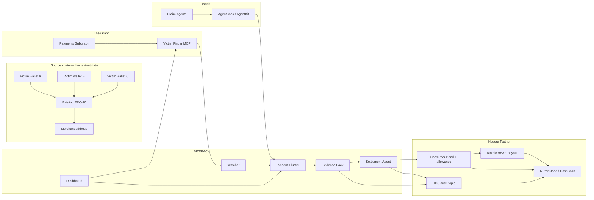
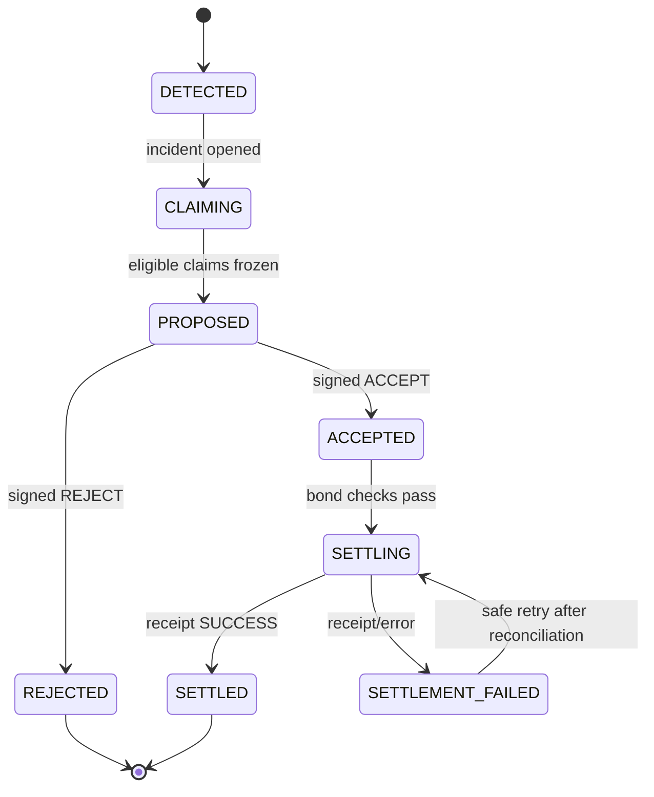

# BITEBACK — Hackathon Blueprint

> **When protocols bite, wallets bite back.**

**Evento:** ETHGlobal Lisbon 2026

**Janela:** 24–26 julho 2026

**Deadline:** domingo, 26 julho, 09:00 WEST

**Categoria:** Autonomous collective redress for on-chain users

**Implementação:** projeto novo, TypeScript, testnets, sem Solidity próprio

**Estado deste documento:** plano de execução; o `README.md` final deve descrever apenas o que estiver realmente implementado

## Convenções

- **P0** — necessário para submeter e demonstrar.
- **P1** — aumenta muito a qualidade, sem bloquear o fluxo principal.
- **P2** — apenas depois de feature freeze.
- **DoD** — Definition of Done.
- Nunca apresentar dados mockados como live.
- Nunca deixar um LLM decidir factos, elegibilidade, montantes ou destinatários.
- Links, IDs, endereços e hashes assinalados como `<...>` são preenchidos durante a implementação.

---

## 1. Resumo executivo

### Problema

Quando um protocolo cobra demasiado, paga menos do que prometeu ou executa incorretamente uma distribuição, cada utilizador tem de descobrir o problema sozinho, reunir provas e pedir compensação individualmente. Pequenos prejuízos ficam por reclamar porque o custo de agir é maior do que o valor perdido.

### Solução

BITEBACK é uma camada de proteção coletiva que:

1. consulta dados on-chain live;
2. deteta violações determinísticas;
3. encontra carteiras afetadas pela mesma regra;
4. agrupa-as num incidente;
5. aceita claims apenas de agentes autorizados por carteiras afetadas e associados a humanos únicos;
6. cria um Evidence Pack verificável;
7. pede uma decisão assinada ao merchant;
8. distribui HBAR automaticamente a partir de um Consumer Bond autorizado;
9. ancora regras, hashes, decisões e pagamentos no Hedera Consensus Service.

### Exemplo do MVP

Regra:

```text
No máximo 1 cobrança, por payer, por merchant, por dia UTC.
```

Dados live:

```text
3 vítimas
2 cobranças de 2 unidades a cada vítima
1 cobrança válida + 1 cobrança indevida por vítima
Claim coletivo: 6 HBAR
Settlement: 2 HBAR por vítima
```

O exemplo original com cinco vítimas e 10 HBAR continua válido como narrativa de escala, mas o demo usa exatamente três vítimas para reduzir risco.

### Tese

O produto não é um tribunal nem decide disputas subjetivas. É uma infraestrutura opt-in para:

- deteção verificável;
- coordenação de vítimas;
- autorização humana resistente a Sybil;
- resposta do merchant;
- settlement coletivo automático;
- auditoria pública.

### Frase de elevador

> BITEBACK detects when many wallets suffer the same on-chain harm, organizes unique human-backed claimants, and automatically pays collective refunds from protocol-funded consumer bonds.

### Condição de vitória

O demo só está completo quando uma pessoa consegue ver, numa única sequência:

```text
live transactions
→ detected duplicate charges
→ affected wallets
→ human-backed claim agents
→ signed collective decision
→ atomic HBAR payout
→ HashScan/HCS audit links
```

---

## 2. Escopo fechado do MVP

### Construir

- um merchant;
- uma regra determinística;
- um tipo de violação: pagamento ERC-20 duplicado;
- três carteiras afetadas;
- seis pagamentos live numa rede suportada pelo The Graph;
- um subgraph live que indexa esses pagamentos;
- um Victim Finder MCP com quatro tools reutilizáveis;
- um incidente coletivo;
- delegações assinadas pelas carteiras afetadas;
- Claim Agents registados no World AgentBook;
- proteção AgentKit no endpoint de adesão;
- uma proposta de settlement;
- decisão `ACCEPT` ou `REJECT` assinada pelo merchant;
- Consumer Bond com HBAR em Hedera Testnet;
- allowance HBAR do bond para o Settlement Agent;
- payout atómico para três contas Hedera;
- eventos de auditoria no HCS;
- leitura de saldo, allowance e transações pelo Mirror Node;
- dashboard único com provas e links on-chain;
- vídeo de 2–4 minutos e repositório público.

### Não construir

- sistema jurídico;
- arbitragem subjetiva;
- appeals;
- governance;
- token próprio;
- DAO;
- reputação;
- marketplace;
- suporte multi-chain real;
- vários tipos de violação;
- contratos Solidity próprios;
- autenticação genérica;
- base de dados distribuída;
- microserviços;
- abstrações multi-provider;
- mobile app;
- notificações;
- produção financeira real.

### Regra de corte

Qualquer feature que não melhore diretamente um dos nove beats do demo é removida ou adiada.

---

## 3. Posicionamento correto

### O que dizer

- “collective settlement infrastructure”;
- “deterministic, opt-in consumer protection”;
- “machine-readable evidence”;
- “human-backed claim authorization”;
- “protocol-funded settlement mandate”;
- “automatic payout after an accepted deterministic claim”.

### O que não dizer

- “court”;
- “lawsuit”;
- “legal judgment”;
- “guaranteed refund” sem explicar as condições;
- “trustless escrow” no MVP;
- “fraud proof” quando é apenas prova de violação de uma regra registada;
- “World proves every wallet is a unique person”;
- “The Graph indexes Hedera” se a fonte live estiver noutra chain.

### Formulação legal e técnica

BITEBACK aplica regras publicadas pelo merchant e executa settlements voluntariamente autorizados. O MVP não determina responsabilidade legal e não força pagamentos contestados.

---

## 4. As três melhores tracks

Fontes oficiais verificadas em 25 julho 2026: [ETHGlobal Lisbon 2026 — Prizes](https://ethglobal.com/events/lisbon2026/prizes).

### 4.1 World — AgentKit New Use Cases

**Pool:** $8,000

**Prémios:** $4,000 / $2,500 / $1,500

**Fit:** 10/10

Porquê:

- o Claim Agent atua em nome de uma carteira realmente afetada;
- AgentKit distingue um bot de um agente apoiado por um humano único;
- o estatuto human-backed altera uma autorização económica real: aderir ao claim e receber settlement;
- evita vários Claim Agents controlados pela mesma pessoa reclamarem o mesmo incidente;
- é um workflow novo, não login genérico, reputação ou desconto de API.

Requisitos e prova visível:

| Requisito oficial | Implementação | Prova no demo |
|---|---|---|
| Uso meaningful de AgentKit | endpoint `joinClaim` protegido por AgentKit | request do Claim Agent aceite |
| Verificar human-backed agent | lookup no AgentBook | badge e `humanIdHash` |
| Fluxo end-to-end | delegação → join → payout | vítima recebe HBAR |
| Novo workflow/trust model | autorização coletiva anti-Sybil | uma pessoa por incidente |

DoD da track:

- pelo menos um Claim Agent registado ao vivo no AgentBook;
- idealmente três agentes registados por três humanos distintos;
- o endpoint rejeita agente não registado;
- o endpoint rejeita reutilização do mesmo humano no mesmo incidente;
- a delegação da carteira afetada é verificada separadamente;
- o README explica por que AgentKit é indispensável.

### 4.2 The Graph — Best AI Tooling for The Graph

**Pool:** $5,000

**Prémios:** $2,500 / $1,500 / $1,000

**Fit:** 10/10

Porquê:

- o Victim Finder é um MCP reutilizável, não apenas lógica escondida numa app;
- consulta dados blockchain live através de um subgraph;
- oferece tools genéricas para procurar violações e construir provas;
- pode ser configurado para outros merchants e regras com o mesmo schema;
- o dashboard BITEBACK é o primeiro consumidor da infraestrutura.

Requisitos e prova visível:

| Requisito oficial | Implementação | Prova no demo |
|---|---|---|
| Tooling reutilizável | servidor MCP independente | MCP Inspector/cliente |
| Dados live | endpoint Subgraph Studio/Graph provider | tx hashes e block numbers |
| Open source | repo público | link GitHub |
| README/SKILL claro | instalação + tools + exemplo | secção dedicada |
| Vídeo 2–4 min | demo gravado | link da submissão |

DoD da track:

- `scanViolations`, `findVictims`, `calculateLoss` e `buildEvidencePack` aparecem como MCP tools;
- uma chamada externa consegue usar as tools sem abrir o dashboard;
- outputs têm JSON schemas previsíveis;
- a origem é live e identificada por endpoint/deployment/subgraph ID;
- README inclui configuração, sample call e sample response;
- nenhuma resposta essencial vem de fixture estática.

### 4.3 Hedera — AI & Agentic Payments on Hedera

**Pool:** $6,000

**Prémio:** até duas equipas recebem $3,000

**Fit:** 9.5/10

Porquê:

- o Settlement Agent move valor autonomamente;
- o merchant concede uma allowance HBAR limitada;
- o payout é coletivo e executado na Hedera Testnet;
- HCS cria um audit trail verificável;
- Mirror Node prova saldo, allowance e resultado;
- a integração usa Hedera SDK diretamente, sem smart contracts.

Requisitos e prova visível:

| Requisito oficial | Implementação | Prova no demo |
|---|---|---|
| Agente executa operação financeira | settlement automático após `ACCEPT` | transação Hedera |
| Hedera Testnet | bond, allowance, HCS e payout | links HashScan |
| Hedera SDK/tooling | `@hashgraph/sdk` | código e README |
| Repo e arquitetura | docs públicas | GitHub |
| Vídeo ≤ 5 min | mesmo vídeo principal | link |

DoD da track:

- payout testnet real;
- transação com débito aprovado do Consumer Bond e três créditos;
- HCS regista proposal, decisão e payout;
- Mirror Node confirma transação;
- README mostra payment flow e IDs;
- chave do merchant nunca está no browser.

### Tracks secundárias, sem trabalho extra

Se o formulário permitir mais candidaturas sem trocar as três principais:

1. **Hedera — “No Solidity Allowed”**: encaixa se forem demonstrados HBAR allowances/transfers + HCS + Mirror Node.
2. **The Graph — Best AI Use Case**: encaixa se o agente usa as tools sobre dados live e age sobre o resultado.

Não adicionar features só para estas tracks. Não entrar em Continuity: BITEBACK é um projeto novo.

---

## 5. Arquitetura



### Decisão cross-chain

- **Dano observado:** transferências ERC-20 numa testnet suportada pelo The Graph.
- **Compensação:** HBAR na Hedera Testnet.
- **Ligação:** a delegação assinada associa a carteira afetada ao AgentKit agent e à conta Hedera de payout.
- **Motivo:** The Graph fornece a fonte live; Hedera fornece settlement e auditoria nativos.
- **Limitação assumida:** no MVP não há bridge nem conversão automática do ativo perdido para HBAR.

### Rede da fonte

Preferência:

1. Ethereum Sepolia;
2. ERC-20 de teste existente e verificável;
3. três wallets enviam duas transferências iguais para o mesmo merchant;
4. um subgraph BITEBACK indexa `Transfer` desse token.

Só trocar a rede se uma query live e a publicação do subgraph forem comprovadas primeiro. Não construir contrato de pagamentos próprio.

---

## 6. Componentes

### 6.1 Biteback Watcher

Responsabilidade:

- pedir pagamentos ao Victim Finder MCP;
- aplicar uma regra determinística;
- deduplicar scans;
- criar ou atualizar um Incident Cluster.

Não faz:

- inferência jurídica;
- classificação por LLM;
- settlement;
- verificação humana.

Trigger do MVP:

- botão `Scan for violations`;
- sem cron;
- mesma função reutilizável por CLI/API.

### 6.2 Payments Subgraph

Indexa apenas o necessário:

```graphql
type Payment @entity(immutable: true) {
  id: Bytes!
  txHash: Bytes!
  logIndex: BigInt!
  blockNumber: BigInt!
  timestamp: BigInt!
  token: Bytes!
  payer: Bytes!
  merchant: Bytes!
  amount: BigInt!
}
```

Identificador:

```text
paymentId = txHash + "-" + logIndex
```

Filtros da query:

- `merchant == configuredMerchant`;
- `token == configuredToken`;
- `timestamp >= windowStart`;
- ordem por `timestamp asc`;
- paginação explícita.

### 6.3 Victim Finder MCP

Tools públicas:

```text
scanViolations(ruleId, from, to)
findVictims(incidentId)
calculateLoss(incidentId)
buildEvidencePack(incidentId)
```

O MCP é a infraestrutura reutilizável. A app chama exatamente as mesmas funções que os clientes MCP.

#### `scanViolations`

Input:

```json
{
  "ruleId": "rule_duplicate_daily_v1",
  "from": 1784937600,
  "to": 1785024000
}
```

Output:

```json
{
  "source": "the-graph",
  "live": true,
  "indexedBlock": 9999999,
  "ruleId": "rule_duplicate_daily_v1",
  "violations": [
    {
      "victim": "0x...",
      "validPaymentId": "0x...-0",
      "duplicatePaymentIds": ["0x...-1"],
      "lossSourceUnits": "2000000"
    }
  ]
}
```

#### `findVictims`

Devolve apenas carteiras para as quais existe pelo menos uma cobrança excedente confirmada.

#### `calculateLoss`

Recalcula o prejuízo a partir dos pagamentos; nunca aceita montantes enviados pelo cliente.

#### `buildEvidencePack`

Produz JSON canónico, hash e referências on-chain.

### 6.4 Claim Agent

Cada Claim Agent:

1. tem uma wallet EVM própria;
2. é registado no World AgentBook;
3. recebe uma delegação assinada pela carteira afetada;
4. chama o recurso AgentKit/x402 através de `agentkit.fetch`;
5. indica a conta Hedera de payout;
6. adere apenas ao incidente indicado;
7. não pode alterar o montante calculado.

Configuração do recurso:

```text
statement: Verify that this claim agent is backed by a unique human
mode: free-trial
uses: 1 per human and incident
canonical AgentBook: World Chain
```

O fallback de pagamento x402 nunca concede elegibilidade para um claim. O handler exige explicitamente a verificação human-backed; pagar uma request não transforma um bot numa vítima elegível.

Permissões da delegação:

```text
- join incident <incidentId>
- submit the referenced evidence
- accept the deterministic compensation amount
- receive payout at Hedera account <accountId>
- expires at <timestamp>
```

Mensagem assinada:

```text
BITEBACK_DELEGATION_V1
incidentId=<incidentId>
victim=<sourceWallet>
agent=<agentWallet>
payout=<hederaAccountId>
nonce=<nonce>
expiresAt=<timestamp>
```

Validações:

- assinatura EIP-191 recupera a wallet afetada;
- wallet pertence ao incidente;
- agent da mensagem é o caller;
- agent está human-backed no AgentBook;
- `humanIdHash` ainda não aderiu ao incidente;
- nonce ainda não foi usado;
- delegação não expirou;
- payout account é válida;
- perda é recalculada server-side.

### 6.5 Merchant Agent

Recebe:

```json
{
  "incidentId": "inc_...",
  "evidenceHash": "sha256:...",
  "victims": 3,
  "totalHbar": "6",
  "deadline": "2026-07-25T23:00:00Z"
}
```

Pode:

- `ACCEPT`;
- `REJECT`, com `counterEvidenceHash` e motivo curto.

Decisão assinada:

```text
BITEBACK_DECISION_V1
incidentId=<incidentId>
evidenceHash=<hash>
decision=<ACCEPT|REJECT>
totalTinybar=<amount>
nonce=<nonce>
expiresAt=<timestamp>
```

O MVP não resolve uma rejeição. Regista-a e termina o incidente em `REJECTED`.

### 6.6 Settlement Agent

Responsabilidade:

- validar decisão;
- recalcular payout;
- verificar estado do incidente;
- verificar bond balance e allowance;
- construir uma transferência atómica;
- confirmar receipt;
- publicar o resultado no HCS;
- impedir replay.

Uma camada de modelo pode explicar o incidente e invocar tools, mas:

- não cria vítimas;
- não calcula montantes;
- não escolhe destinatários;
- não assina decisões;
- não ignora invariantes.

### 6.7 Consumer Bond

O MVP usa:

```text
Bond owner: merchant Hedera account
Spender: Settlement Agent Hedera account
Asset: HBAR
Funding target: 100 HBAR
Allowance target: 100 HBAR
```

Setup:

1. merchant mantém pelo menos 100 HBAR numa conta dedicada;
2. merchant aprova 100 HBAR ao Settlement Agent com `AccountAllowanceApproveTransaction`;
3. dashboard lê saldo e allowance;
4. badge `Protected` só aparece se ambos cobrirem o limite anunciado.

Payout:

```text
Bond owner       -6 HBAR  approved transfer
Victim A         +2 HBAR
Victim B         +2 HBAR
Victim C         +2 HBAR
Sum               0 HBAR
```

Usar uma única `TransferTransaction`, para crédito coletivo atómico.

Limitação honesta:

> Uma allowance não é escrow imutável. O merchant pode revogá-la ou esvaziar a conta. O MVP comprova funding e autorização em tempo real; uma versão de produção exigiria um mecanismo de custódia/escrow mais forte.

Não chamar ao MVP “trustless guarantee”.

### 6.8 HCS Audit

Um único topic para o MVP:

```text
HCS_TOPIC_ID=<topic>
memo=BITEBACK_AUDIT_V1
```

Eventos:

```text
RULE_REGISTERED
BOND_STATUS
INCIDENT_OPENED
CLAIM_JOINED
SETTLEMENT_PROPOSED
MERCHANT_ACCEPTED
MERCHANT_REJECTED
PAYOUT_SUBMITTED
PAYOUT_CONFIRMED
```

Envelope:

```json
{
  "schema": "biteback.audit.v1",
  "event": "PAYOUT_CONFIRMED",
  "timestamp": "2026-07-25T20:00:00.000Z",
  "incidentId": "inc_...",
  "payloadHash": "sha256:...",
  "previousEventHash": "sha256:...",
  "hederaTransactionId": "0.0.x@...",
  "actor": "settlement-agent"
}
```

Política:

- HCS guarda hashes e referências, não Evidence Packs grandes;
- não publicar human ID bruto;
- não publicar chaves, assinaturas completas ou PII;
- o dashboard reconstrói a timeline com Mirror Node.

---

## 7. Regra determinística

### Regra registada

```json
{
  "id": "rule_duplicate_daily_v1",
  "version": 1,
  "merchant": "0x...",
  "token": "0x...",
  "sourceChain": "eip155:11155111",
  "maxPayments": 1,
  "bucketSeconds": 86400,
  "sameAmountRequired": true,
  "effectiveFrom": 1784937600,
  "compensationBps": 10000
}
```

### Semântica

Para cada combinação:

```text
(ruleId, merchant, token, payer, UTC day bucket, amount)
```

ordenar pagamentos por:

```text
(timestamp asc, blockNumber asc, logIndex asc)
```

O primeiro pagamento é válido. Todos os seguintes são duplicados.

### Fórmula

```text
bucket = floor(timestamp / 86400)
duplicateCount = max(0, paymentCount - maxPayments)
lossSourceUnits = sum(amount of duplicate payments)
compensationHbar = configured demo compensation per duplicate
```

No MVP, o câmbio source token → HBAR não é calculado. A regra contém explicitamente a compensação HBAR por cobrança duplicada:

```text
refundPerDuplicateTinybar = 200_000_000
```

Isto evita oráculos, volatilidade e uma conversão falsa.

### Confirmações e reorg

- considerar apenas blocos já indexados;
- guardar `indexedBlock`;
- exigir uma margem de confirmações configurada;
- nunca pagar um evento desaparecido após reorg;
- voltar a consultar os payment IDs imediatamente antes da proposta.

### Invariantes

```text
victimCount > 0
totalPayout = sum(victimPayouts)
totalPayout <= acceptedAmount
totalPayout <= allowance
totalPayout <= bondBalance - feeBuffer
each victim appears once
each paymentId appears once
each humanIdHash appears once per incident
evidenceHash == acceptedEvidenceHash
incident can settle once
```

---

## 8. Evidence Pack

### Estrutura

```json
{
  "schema": "biteback.evidence.v1",
  "incidentId": "inc_...",
  "rule": {
    "id": "rule_duplicate_daily_v1",
    "hash": "sha256:...",
    "merchant": "0x...",
    "token": "0x...",
    "sourceChain": "eip155:11155111"
  },
  "source": {
    "provider": "the-graph",
    "subgraphId": "<SUBGRAPH_ID>",
    "deploymentId": "<DEPLOYMENT_ID>",
    "indexedBlock": 9999999,
    "queriedAt": "2026-07-25T18:00:00.000Z"
  },
  "victims": [
    {
      "sourceWallet": "0x...",
      "validPayment": {
        "id": "0x...-0",
        "txHash": "0x...",
        "timestamp": 1784990000,
        "amount": "2000000"
      },
      "duplicatePayments": [
        {
          "id": "0x...-1",
          "txHash": "0x...",
          "timestamp": 1784990300,
          "amount": "2000000"
        }
      ],
      "lossSourceUnits": "2000000",
      "payoutTinybar": "200000000"
    }
  ],
  "totals": {
    "victims": 3,
    "duplicatePayments": 3,
    "payoutTinybar": "600000000"
  }
}
```

### Canonicalização

- ordenar vítimas por `sourceWallet`;
- ordenar pagamentos por `paymentId`;
- números monetários como strings inteiras;
- timestamps ISO ou Unix, nunca locale;
- serializar com JSON canónico;
- `evidenceHash = sha256(canonicalJson)`.

### IDs

```text
violationId = sha256(ruleId | victim | bucket | sortedDuplicatePaymentIds)
incidentId  = sha256(ruleId | merchant | bucket | sortedViolationIds)
claimId     = sha256(incidentId | victim)
```

---

## 9. State machine



### Transições

| De | Para | Autoridade | Pré-condições |
|---|---|---|---|
| `DETECTED` | `CLAIMING` | Watcher | Evidence inicial válido |
| `CLAIMING` | `PROPOSED` | Settlement Agent | claims elegíveis congelados |
| `PROPOSED` | `ACCEPTED` | Merchant | assinatura e evidence hash válidos |
| `PROPOSED` | `REJECTED` | Merchant | assinatura válida |
| `ACCEPTED` | `SETTLING` | Settlement Agent | bond solvente |
| `SETTLING` | `SETTLED` | Hedera receipt | `SUCCESS` confirmado |

Não existe auto-accept por timeout no MVP. Mostrar deadline é P1; executar timeout é pós-hackathon.

---

## 10. API mínima

```text
GET  /api/health
GET  /api/bond
POST /api/scan
GET  /api/incidents
GET  /api/incidents/:id
POST /api/incidents/:id/join
POST /api/incidents/:id/propose
POST /api/incidents/:id/decision
POST /api/incidents/:id/settle
GET  /api/incidents/:id/audit
POST /mcp
```

### Autorizações

| Endpoint | Caller | Proteção |
|---|---|---|
| `/scan` | operador/demo | token server-side simples |
| `/join` | Claim Agent | AgentKit + delegação assinada |
| `/propose` | Settlement Agent | chamada interna |
| `/decision` | Merchant Agent | assinatura EIP-191 |
| `/settle` | Settlement Agent | estado + idempotency key |
| reads | público | sem segredos |

### Erros previsíveis

```json
{
  "error": {
    "code": "CLAIM_HUMAN_ALREADY_USED",
    "message": "This human-backed agent already joined this incident."
  }
}
```

Códigos necessários:

```text
RULE_NOT_FOUND
GRAPH_QUERY_FAILED
NO_VIOLATIONS
VICTIM_NOT_IN_INCIDENT
INVALID_DELEGATION
DELEGATION_EXPIRED
AGENT_NOT_HUMAN_BACKED
CLAIM_HUMAN_ALREADY_USED
CLAIM_ALREADY_JOINED
INVALID_MERCHANT_SIGNATURE
EVIDENCE_HASH_MISMATCH
BOND_INSUFFICIENT
ALLOWANCE_INSUFFICIENT
INCIDENT_NOT_SETTLEABLE
PAYOUT_ALREADY_EXECUTED
HEDERA_TRANSACTION_FAILED
```

---

## 11. Persistência

Para o hackathon:

- um ficheiro JSON local ou SQLite;
- escolher um, não ambos;
- preferência: SQLite se houver deploy persistente disponível; JSON local para execução e vídeo;
- sem ORM;
- sem migrations framework;
- sem cache adicional.

Entidades mínimas:

```text
rules
payments_seen
incidents
claims
decisions
payouts
audit_events
used_nonces
human_usage
```

Requisitos:

- write atómico;
- uniqueness para IDs e nonces;
- estado recuperável depois de restart;
- nenhum private key ou human ID bruto persistido.

---

## 12. Estrutura do repositório

Objetivo: um package, um servidor, um dashboard, um subgraph.

```text
.
├── README.md
├── BLUEPRINT.md
├── package.json
├── tsconfig.json
├── .env.example
├── src
│   ├── server.ts
│   ├── domain.ts
│   ├── graph.ts
│   ├── victimFinder.ts
│   ├── world.ts
│   ├── hedera.ts
│   └── mcp.ts
├── public
│   └── index.html
├── subgraph
│   ├── schema.graphql
│   ├── subgraph.yaml
│   └── src
│       └── mapping.ts
├── scripts
│   └── setupDemo.ts
└── test
    └── detector.test.ts
```

Regras:

- só separar um ficheiro quando tiver uma responsabilidade externa clara;
- sem `utils/`, `helpers/`, `services/`, `providers/` ou wrappers genéricos;
- `domain.ts` contém types, regras e state machine;
- `graph.ts`, `world.ts` e `hedera.ts` são integrações diretas;
- `victimFinder.ts` contém as quatro operações;
- `mcp.ts` apenas expõe essas operações;
- `setupDemo.ts` cria/verifica dados necessários e é idempotente;
- não recuperar código legacy.

---

## 13. Configuração

Variáveis esperadas:

```dotenv
# Server
PORT=8402
PUBLIC_BASE_URL=
OPERATOR_TOKEN=

# Source chain / The Graph
SOURCE_CHAIN_ID=11155111
SOURCE_RPC_URL=
SOURCE_TOKEN_ADDRESS=
SOURCE_MERCHANT_ADDRESS=
SOURCE_MERCHANT_PRIVATE_KEY=
VICTIM_A_PRIVATE_KEY=
VICTIM_B_PRIVATE_KEY=
VICTIM_C_PRIVATE_KEY=
GRAPH_API_KEY=
SUBGRAPH_QUERY_URL=
SUBGRAPH_ID=
SUBGRAPH_DEPLOYMENT_ID=

# World AgentKit
WORLD_AGENT_A_PRIVATE_KEY=
WORLD_AGENT_B_PRIVATE_KEY=
WORLD_AGENT_C_PRIVATE_KEY=
WORLD_X402_FACILITATOR=https://x402-worldchain.vercel.app/facilitator
WORLD_PAY_TO_ADDRESS=

# Hedera
HEDERA_NETWORK=testnet
HEDERA_OPERATOR_ACCOUNT_ID=
HEDERA_OPERATOR_PRIVATE_KEY=
HEDERA_BOND_ACCOUNT_ID=
HEDERA_BOND_PRIVATE_KEY=
HEDERA_SETTLEMENT_ACCOUNT_ID=
HEDERA_SETTLEMENT_PRIVATE_KEY=
HEDERA_VICTIM_A_ACCOUNT_ID=
HEDERA_VICTIM_B_ACCOUNT_ID=
HEDERA_VICTIM_C_ACCOUNT_ID=
HCS_TOPIC_ID=
HEDERA_MIRROR_NODE_URL=https://testnet.mirrornode.hedera.com
```

Política:

- `.env` nunca entra no Git;
- `.env.example` não contém valores reais;
- browser recebe apenas IDs/endpoints públicos;
- todas as private keys ficam no servidor;
- o merchant assina allowance e decisões fora do browser público;
- rodar secret scan antes do push.

---

## 14. Plano de sprints

O relógio é relativo a `T0 = início da implementação BITEBACK`. Feature freeze obrigatória em `T+22h`. Reservar o final para vídeo e submissão.

Assunção: uma pessoa a construir. Se houver equipa, só paralelizar Graph, World e Hedera depois das decisões do Sprint 0; manter um único owner para o fluxo E2E.

### Sprint 0 — Freeze técnico e acessos (`T+0h → T+1h`) — P0

Objetivo: provar todas as dependências externas antes de construir UI.

Tarefas:

- confirmar deadline no dashboard ETHGlobal;
- confirmar as três tracks no formulário;
- criar/validar Graph API key;
- escolher rede e ERC-20 live;
- provar uma query Graph live;
- validar três wallets source;
- criar/validar contas Hedera Testnet;
- transferir 100 HBAR para o bond;
- provar uma transferência Hedera mínima;
- criar HCS topic;
- instalar AgentKit;
- recrutar três humanos para registar três Claim Agents.

DoD:

- tx hash source válido;
- query Graph responde;
- Hedera receipt `SUCCESS`;
- HCS message visível;
- pelo menos um AgentKit registration concluído;
- decisões registadas no topo do README/blueprint.

Kill criteria:

- se o subgraph não puder indexar a rede escolhida em 30 minutos, mudar para Ethereum Sepolia;
- se três verificações World não estiverem disponíveis, garantir uma real e adaptar o demo sem fingir unicidade.

### Sprint 1 — Dados live e subgraph (`T+1h → T+4h`) — P0

Tarefas:

- configurar subgraph sobre o ERC-20 existente;
- indexar `Transfer`;
- filtrar merchant na query, não no mapping;
- publicar no Graph provider;
- gerar seis transferências live;
- confirmar indexação dos seis eventos;
- guardar links dos explorers.

DoD:

```text
3 payers × 2 transfers
same merchant
same token
same amount per payer
same UTC bucket
all returned by a live Graph query
```

Fallback:

- usar transações testnet live previamente geradas durante o evento;
- nunca substituir a fonte principal por JSON estático.

### Sprint 2 — Detector e Victim Finder MCP (`T+4h → T+8h`) — P0

Tarefas:

- implementar a regra;
- criar IDs determinísticos;
- implementar as quatro operações;
- expor MCP Streamable HTTP;
- adicionar input/output schemas;
- testar via MCP Inspector;
- criar Evidence Pack canónico;
- adicionar unit tests.

DoD:

- encontra exatamente três vítimas;
- calcula exatamente três duplicados;
- calcula 2 HBAR por vítima e 6 HBAR total;
- repetir o scan não duplica o incidente;
- um cliente MCP externo obtém o Evidence Pack.

Não fazer:

- natural-language query genérica;
- registry de regras extensível;
- schemas multi-protocolo;
- LLM dentro do detector.

### Sprint 3 — Hedera bond e audit (`T+8h → T+11h`) — P0

Tarefas:

- aprovar HBAR allowance bond → Settlement Agent;
- ler saldo e allowance pelo Mirror Node;
- publicar `RULE_REGISTERED`;
- publicar `BOND_STATUS`;
- implementar HCS event envelope;
- construir payout atómico em dry run;
- validar links HashScan.

DoD:

- dashboard/API mostra 100 HBAR funded;
- allowance ≥ 100 HBAR;
- dois serviços nativos comprovados: Accounts/HBAR + HCS;
- Mirror Node confirma os dados.

### Sprint 4 — World Claim Agents (`T+11h → T+14h`) — P0

Tarefas:

- registar agent wallets no AgentBook;
- criar AgentKit client;
- proteger `joinClaim`;
- implementar delegação EIP-191;
- persistir nonces;
- persistir `humanIdHash` salted;
- bloquear segundo claim do mesmo humano;
- criar uma demonstração de rejeição.

DoD:

- agent human-backed + delegação válida entra;
- bot/não registado falha;
- wallet não afetada falha;
- nonce repetido falha;
- mesmo humano no mesmo incidente falha;
- nenhum human ID bruto aparece na UI/HCS.

### Sprint 5 — Decisão e settlement (`T+14h → T+17h`) — P0

Tarefas:

- gerar proposal;
- assinar `ACCEPT` e `REJECT`;
- validar signer merchant;
- congelar claims;
- verificar evidence hash;
- executar payout aprovado;
- confirmar receipt;
- reconciliar pelo Mirror Node;
- publicar eventos HCS;
- impedir segundo payout.

DoD happy path:

```text
PROPOSED → ACCEPTED → SETTLING → SETTLED
```

DoD rejection path:

```text
PROPOSED → REJECTED
no payout
counter-evidence reference recorded
```

### Sprint 6 — Dashboard (`T+17h → T+20h`) — P0

Uma página, cinco áreas:

1. hero + tagline;
2. bond status;
3. scan/live source;
4. incident + vítimas + evidence;
5. settlement + audit timeline.

Elementos obrigatórios:

- botão `Scan for violations`;
- `LIVE via The Graph`;
- indexed block;
- três victim rows;
- pares de tx hashes;
- AgentKit status;
- proposal total;
- `Accept` e `Reject`;
- payout receipts;
- links Graph explorer, source explorer, HashScan e HCS.

DoD:

- demo completo sem abrir terminal;
- loading e erro claros;
- sem dados hardcoded apresentados como rede;
- nenhum segredo no HTML;
- viewport de apresentação funciona.

### Sprint 7 — E2E e hardening (`T+20h → T+22h`) — P0

Testar:

- happy path;
- rejection path;
- replay de claim;
- replay de payout;
- evidence hash alterado;
- bond insuficiente;
- allowance insuficiente;
- Graph indisponível;
- HCS indisponível depois do payout;
- restart entre proposal e settlement.

DoD:

- happy path repetível a partir de setup limpo;
- nenhum erro silencioso;
- payout desconhecido é reconciliado antes de retry;
- logs suficientes para demo/debug;
- `npm test` e `npm run build` passam.

### Feature freeze (`T+22h`)

Depois deste ponto:

- zero features novas;
- apenas bugs, copy, documentação e gravação;
- criar tag/commit de demo estável;
- manter uma segunda cópia das credenciais fora do repo.

### Sprint 8 — README, deploy e track proof (`T+22h → T+25h`) — P0

README:

- problema;
- solução;
- arquitetura;
- demo flow;
- setup;
- env;
- comandos;
- The Graph integration;
- World AgentKit integration;
- Hedera payment flow;
- deployment IDs;
- contract section: “No custom smart contracts”;
- limitations;
- security;
- links.

Deploy:

- URL pública ou instrução local de uma linha;
- healthcheck;
- secrets server-side;
- cold start testado;
- links abrem sem login.

### Sprint 9 — Vídeo e submissão (`T+25h → T+28h`) — P0

Tarefas:

- resetar demo;
- ensaiar duas vezes;
- gravar uma take de 2:30–3:30;
- confirmar áudio e legibilidade;
- publicar vídeo;
- preencher formulário;
- escolher as três tracks;
- adicionar GitHub e live URL;
- submeter antes das 08:30 WEST;
- verificar página final da submissão.

Buffer:

- `T+28h → deadline`;
- só corrigir blocker de submissão;
- não regravar por perfeccionismo.

---

## 15. Backlog priorizado

### P0

- fonte Graph live;
- detector determinístico;
- Victim Finder MCP;
- três vítimas;
- pelo menos um AgentKit flow real;
- delegação wallet → agent → payout;
- merchant decision;
- bond + allowance;
- HBAR payout;
- HCS;
- Mirror Node/HashScan links;
- dashboard;
- README;
- vídeo;
- submissão.

### P1

- três humanos World reais;
- bot rejection visível;
- rejection path visível;
- agent tool-calling explanation;
- chain-of-hashes HCS;
- live deploy;
- badge `Protected by BITEBACK`;
- MCP sample client.

### P2

- auto-refresh;
- countdown de decisão;
- QR World registration;
- export Evidence Pack;
- copy-to-clipboard;
- animações;
- múltiplos incidents.

### Proibido antes da submissão

- segundo tipo de violação;
- nova chain;
- token próprio;
- arbitragem;
- smart contract;
- refactor arquitetural;
- design system;
- base de dados remota.

---

## 16. Test plan

### Unit tests do detector

| Caso | Resultado |
|---|---|
| zero pagamentos | zero violações |
| um pagamento | zero violações |
| dois iguais no mesmo bucket | um duplicado |
| três iguais | dois duplicados |
| dois montantes diferentes | sem duplicado no MVP |
| merchants diferentes | grupos separados |
| tokens diferentes | grupos separados |
| buckets UTC diferentes | grupos separados |
| mesma tx processada duas vezes | uma ocorrência |
| ordem de Graph diferente | mesmo Evidence Pack/hash |

### Integration tests

- Graph query retorna transações live;
- indexed block é guardado;
- MCP schemas validam;
- AgentBook lookup confirma agent;
- invalid agent é bloqueado;
- HBAR allowance é lida;
- approved transfer funciona;
- HCS publish retorna sequence number;
- Mirror Node encontra payout.

### E2E happy path

```text
setup demo
→ scan
→ 3 violations
→ 3 valid claims
→ proposal 6 HBAR
→ merchant accepts
→ atomic payout
→ 3 recipients credited
→ HCS timeline complete
```

### E2E rejection path

```text
proposal
→ merchant rejects
→ no payout transaction
→ rejection event in HCS
```

### Teste de idempotência

- repetir `scan`: mesmo incident ID;
- repetir `join`: `CLAIM_ALREADY_JOINED`;
- repetir `decision`: mesma decisão sem novo evento financeiro;
- repetir `settle`: devolver payout existente;
- timeout desconhecido: procurar transaction ID antes de criar outra.

---

## 17. Segurança e integridade

### Chaves

- nunca enviar private keys ao frontend;
- usar contas testnet separadas por papel;
- não reutilizar contas pessoais;
- limitar saldo do Settlement Agent;
- bond allowance limitada;
- revogar allowance depois do hackathon;
- rodar `git grep`/secret scanner antes do push.

### Claims

- assinatura da victim wallet obrigatória;
- domínio e versão na mensagem;
- incident ID e payout account dentro da assinatura;
- nonce único;
- expiry curta;
- AgentKit human-backed obrigatório;
- uniqueness por `hash(appSalt | humanId | incidentId)`;
- não confiar no endereço enviado pelo JSON.

### Settlement

- montantes inteiros em tinybar;
- sem floats;
- payout recalculado;
- evidence hash imutável depois de `PROPOSED`;
- merchant signer allowlisted na regra;
- allowance, balance e estado verificados imediatamente antes;
- uma transação atómica;
- idempotency key por incident;
- receipt `SUCCESS` antes de `SETTLED`.

### HCS

- HCS não é a base de dados operacional;
- publicar hashes, não dados sensíveis;
- se HCS falhar depois do payout, marcar `AUDIT_PENDING`, não repetir o payout;
- reconciliar pelo transaction ID.

### LLM/agent

- tool inputs validados;
- system prompt não substitui invariantes;
- modelo nunca recebe private keys;
- modelo não assina;
- modelo não define eligibility;
- toda ação financeira passa por código determinístico.

---

## 18. Riscos e fallbacks

| Risco | Impacto | Mitigação | Fallback honesto |
|---|---|---|---|
| Subgraph demora a indexar | demo sem vítimas | publicar/gerar txs cedo | usar txs live já indexadas durante o evento |
| Graph endpoint falha | scan bloqueado | retry curto + healthcheck | mostrar vídeo gravado do fluxo live |
| Não há três humanos World | três claims impossíveis | recrutar no Sprint 0 | um claim real; não falsificar três humanos |
| AgentKit beta muda | join bloqueado | seguir sample oficial | mostrar lookup real mínimo e documentar blocker |
| HBAR allowance falha | sem bond payout | testar no Sprint 0/3 | funding account controlada pelo Settlement Agent, claramente rotulada |
| Bond é drenado/revogado | insolvência | check live antes do badge e payout | estado `BOND_INSUFFICIENT`, sem pagamento |
| Merchant rejeita | sem payout | demo também cobre `ACCEPT` | rejeição auditada, sem arbitragem |
| HCS falha após payout | timeline incompleta | guardar tx ID antes de publish | `AUDIT_PENDING`, retry apenas HCS |
| Segundo payout por retry | perda de fundos | idempotência + reconciliation | intervenção manual, nunca retry cego |
| Conversão token/HBAR contestada | montante ambíguo | compensação HBAR fixa na regra | explicar que não existe FX no MVP |
| Cross-chain wallet mapping falso | payout errado | delegação assina Hedera account | claim rejeitado |
| UI consome demasiado tempo | submissão em risco | HTML único | demo por API/terminal como último recurso |

### Ordem de proteção

Se o tempo acabar:

1. preservar Graph live;
2. preservar AgentKit real;
3. preservar Hedera payout real;
4. cortar animações;
5. cortar deploy e correr local;
6. cortar rejection UI, mantendo API;
7. nunca cortar evidência, idempotência ou vídeo.

---

## 19. Dashboard

### Hierarquia visual

```text
[BITEBACK logo]  When protocols bite, wallets bite back.

[Protected merchant] [100 HBAR bond] [Allowance active] [HCS topic]

[Scan for violations]
LIVE via The Graph · indexed at block ####

Incident #...
Rule: max 1 charge / user / UTC day
3 affected wallets · 6 HBAR proposed

Wallet          Charges       Duplicate       Claim Agent       Refund
0xA...          tx ↗ tx ↗     detected        human-backed      2 HBAR
0xB...          tx ↗ tx ↗     detected        human-backed      2 HBAR
0xC...          tx ↗ tx ↗     detected        human-backed      2 HBAR

[Accept settlement] [Reject]

SETTLED
Victim A tx ↗ · Victim B tx ↗ · Victim C tx ↗
HCS audit ↗ · HashScan ↗
```

### Estados de UI

```text
READY
SCANNING
INCIDENT_FOUND
COLLECTING_CLAIMS
PROPOSED
ACCEPTED
SETTLING
SETTLED
REJECTED
ERROR
```

### Copy

- `Scan live payments`
- `3 wallets suffered the same rule violation`
- `Claims are authorized by unique human-backed agents`
- `Merchant accepted 100% compensation`
- `6 HBAR distributed atomically`
- `Every step is publicly auditable`

---

## 20. Demo de 2 minutos

### Setup antes de gravar

- app limpa em `READY`;
- merchant bond com 100 HBAR;
- allowance ativa;
- seis source transactions já indexadas;
- três Claim Agents preparados;
- incident database limpa, sem apagar dados on-chain;
- explorers abertos em tabs;
- terminal e notificações escondidos;
- zoom legível;
- gravação a 1080p.

### Guião

**0:00–0:15 — problema**

> A protocol charged several users twice. Each loss is small, so victims normally have to discover and fight it alone. BITEBACK turns the same on-chain harm into one collective settlement.

Mostrar merchant:

```text
Protected by BITEBACK
Consumer Bond: 100 HBAR
Rule: maximum one charge per user per day
```

**0:15–0:40 — The Graph**

Clicar `Scan live payments`.

> The Victim Finder MCP queries live data through The Graph. It detects the same deterministic violation for three wallets and returns the exact transactions, timestamps, amounts and violated rule.

Mostrar:

- `LIVE`;
- indexed block;
- três victims;
- seis tx links;
- Evidence Pack hash.

**0:40–1:05 — World**

> Each affected wallet delegates a Claim Agent. World AgentKit proves the agent is backed by a unique human, while the wallet signature proves it is authorized by an actual victim.

Mostrar:

- delegation valid;
- human-backed badge;
- três claims;
- tentativa duplicada bloqueada, se estável.

**1:05–1:25 — collective proposal**

> The deterministic agent recalculates every loss. Three victims, two HBAR each, six HBAR total. No model can change these numbers.

Mostrar proposal e Evidence Pack.

**1:25–1:45 — Hedera**

Clicar `Accept settlement`.

> The merchant accepts the evidence hash. The Settlement Agent uses the pre-authorized Consumer Bond and pays all victims atomically on Hedera Testnet.

Mostrar `SETTLING → SETTLED`.

**1:45–2:00 — audit e close**

Abrir HashScan/HCS.

> The rule, evidence hash, decision and payout are anchored in HCS and auditable through Mirror Node and HashScan. When protocols bite, wallets bite back.

### Demo alternativo: rejection

Só mostrar se houver tempo:

```text
REJECT
→ counter-evidence hash
→ HCS event
→ zero payout
```

---

## 21. Pitch

### 15 segundos

> BITEBACK automatically detects when multiple wallets suffer the same on-chain violation, organizes unique human-backed claimants, and pays collective refunds from protocol-funded bonds.

### 30 segundos

> Small on-chain losses rarely get fixed because every user has to investigate and complain alone. BITEBACK uses The Graph to find shared deterministic harm, World AgentKit to ensure each delegated Claim Agent represents a unique human, and Hedera to distribute accepted compensation from a pre-authorized Consumer Bond. It is not a court. It is an autonomous detection, claims and settlement layer for crypto users.

### Pitch principal

> BITEBACK is an autonomous consumer-protection layer for crypto. It uses The Graph to detect shared on-chain harm, World to organize unique human-backed claimants, and Hedera to distribute compensation from protocol-funded consumer bonds.

### Três beats para judges

1. **Discovery, not a complaint form:** victims are found automatically from live data.
2. **Human-backed delegation, not wallet counting:** World prevents one person from multiplying claims.
3. **Settlement, not a dashboard:** accepted compensation moves on Hedera and leaves an HCS audit trail.

---

## 22. Texto de submissão

### Short description

> BITEBACK detects shared on-chain rule violations, organizes unique human-backed claim agents, and automatically distributes collective refunds from merchant-funded HBAR bonds.

### Problem

> On-chain users often suffer the same small loss—duplicate charges, excessive fees or incorrect rewards—but each wallet must detect, prove and dispute it alone. Most losses are too small to justify the effort, so protocols face weak incentives to resolve them quickly.

### Solution

> BITEBACK turns deterministic shared harm into one auditable settlement flow. A reusable Victim Finder MCP queries live blockchain data through The Graph, groups affected wallets and builds machine-readable evidence. Each victim delegates a Claim Agent whose human backing is verified by World AgentKit. A merchant can accept or reject the collective request. If accepted, a Settlement Agent automatically distributes HBAR from a pre-authorized Hedera Consumer Bond and anchors the lifecycle in HCS.

### How The Graph is used

> The Graph is a load-bearing live data source. Our subgraph indexes payment transfers and the Victim Finder MCP exposes reusable tools to scan violations, find victims, calculate losses and build evidence packs. The application cannot discover an incident without live Graph data.

### How World is used

> The claim endpoint is protected by AgentKit. A source-wallet signature proves that a detected victim delegated authority to the calling agent; AgentBook verification proves that the agent is backed by a unique human. BITEBACK therefore grants economic claim rights to human-backed agents rather than counting arbitrary wallets.

### How Hedera is used

> The merchant funds a dedicated HBAR account and grants a limited allowance to the Settlement Agent. After a signed acceptance, the agent executes one atomic multi-recipient HBAR transfer on Hedera Testnet. HCS records rules, evidence hashes, decisions and payout references, while Mirror Node and HashScan provide public verification. No custom Solidity contracts are used.

### What is novel

> Existing claim aggregation starts after people report a problem. BITEBACK begins with live on-chain detection, identifies victims automatically, makes claims machine-readable, prevents duplicated human participation and completes compensation on-chain.

### Limitations

> The MVP supports one opt-in merchant, one duplicate-payment rule, testnet data and HBAR compensation. Rejected claims are only recorded; there is no arbitration. The HBAR allowance is a revocable settlement mandate, not immutable escrow.

---

## 23. Judge scorecards

### World

| Critério esperado | Resposta BITEBACK |
|---|---|
| AgentKit meaningful | controla adesão e direito económico |
| Human-backed | AgentBook obrigatório |
| Novo caso de uso | collective consumer redress |
| End-to-end | verified agent recebe settlement |
| Abuse prevention | human uniqueness + victim signature |

### The Graph

| Critério oficial | Peso | Resposta BITEBACK |
|---|---:|---|
| Usefulness to builders | 30% | MCP reutilizável |
| Reusability/completeness | 25% | quatro tools + schemas + README |
| Effective Graph use | 20% | fonte live load-bearing |
| Technical execution | 15% | evidence canónico/idempotência |
| Innovation | 10% | victim discovery infrastructure |

### Hedera

| Critério esperado | Resposta BITEBACK |
|---|---|
| Agentic value movement | payout automático pós-decisão |
| Native Hedera use | allowance + HBAR transfer + HCS |
| Real flow | três destinatários testnet |
| Auditability | Mirror Node + HashScan + HCS |
| Security | caps, signatures, idempotência |

---

## 24. Runbook

### Setup

```bash
npm install
npm run build
npm run setup:demo
npm test
npm start
```

O `setup:demo` deve:

1. validar env;
2. validar source wallets e saldos;
3. criar apenas as transferências em falta;
4. aguardar/confirmar indexação;
5. validar Hedera accounts;
6. criar HCS topic apenas se não existir;
7. fundar bond apenas até ao target;
8. aprovar allowance apenas até ao target;
9. imprimir IDs e explorer links;
10. poder correr duas vezes sem duplicar setup.

### Healthcheck

```json
{
  "server": "ok",
  "graph": {
    "ok": true,
    "indexedBlock": 9999999
  },
  "world": {
    "ok": true,
    "registeredAgents": 3
  },
  "hedera": {
    "ok": true,
    "bondTinybar": "10000000000",
    "allowanceTinybar": "10000000000",
    "topicId": "0.0.x"
  }
}
```

### Reset de demo

Resetar apenas estado local:

```text
incidents
claims
decisions
payout display state
used demo nonces
```

Não apagar:

- source transactions;
- HCS topic;
- AgentBook registrations;
- Hedera transaction history.

Para repetir payout, criar novo incident bucket ou usar novas contas/funding. Nunca esconder um payout anterior como se não tivesse ocorrido.

---

## 25. Checklist de submissão

### Produto

- [ ] Uma regra registada
- [ ] 100 HBAR no Consumer Bond
- [ ] Allowance ativa
- [ ] HCS topic live
- [ ] Seis pagamentos source live
- [ ] Subgraph live
- [ ] Três violações detetadas
- [ ] Evidence Pack com hash
- [ ] Claim Agent human-backed
- [ ] Delegação de victim wallet válida
- [ ] Proposal com 6 HBAR
- [ ] `ACCEPT` executa payout
- [ ] `REJECT` não executa payout
- [ ] Mirror Node confirma
- [ ] HashScan links funcionam
- [ ] Replay bloqueado

### The Graph

- [ ] MCP é utilizável fora da app
- [ ] Quatro tools documentadas
- [ ] Dados live, não mocks
- [ ] Subgraph/deployment/endpoint identificados
- [ ] Indexed block visível
- [ ] README com sample calls
- [ ] Vídeo 2–4 min

### World

- [ ] AgentKit package oficial
- [ ] Agent registado no AgentBook
- [ ] Human-backed verification real
- [ ] Endpoint protegido
- [ ] Fluxo end-to-end
- [ ] Uniqueness muda eligibility
- [ ] Bot/duplicate rejeitado

### Hedera

- [ ] Hedera Testnet
- [ ] `@hashgraph/sdk`
- [ ] HBAR allowance
- [ ] Payout real
- [ ] HCS audit
- [ ] Mirror Node
- [ ] README payment flow
- [ ] Vídeo ≤ 5 min
- [ ] Sem Solidity próprio

### Repositório

- [ ] Público
- [ ] Nome BITEBACK
- [ ] Licença
- [ ] README reproduzível
- [ ] `.env.example`
- [ ] Sem secrets
- [ ] Sem código morto
- [ ] Sem TODOs legacy
- [ ] Build limpo
- [ ] Tests passam
- [ ] Git history real durante o evento

### Submissão

- [ ] Título
- [ ] Tagline
- [ ] Short description
- [ ] Long description
- [ ] GitHub URL
- [ ] Live URL
- [ ] Video URL
- [ ] Team members
- [ ] Deployment IDs
- [ ] Source tx hashes
- [ ] Subgraph ID
- [ ] HCS topic ID
- [ ] Hedera transaction IDs
- [ ] Escolher World AgentKit New Use Cases
- [ ] Escolher The Graph Best AI Tooling
- [ ] Escolher Hedera AI & Agentic Payments
- [ ] Submeter antes das 08:30 WEST
- [ ] Abrir a página final e validar todos os links

---

## 26. Plano pós-hackathon

### Fase 1 — Generalizar deteção

- fees acima do publicado;
- amount-out abaixo da garantia;
- reward distributions incorretas;
- payment sem delivery event;
- schemas de regras versionados.

### Fase 2 — Bond forte

- escrow não revogável;
- reservas por incident;
- cobertura mínima dinâmica;
- monitor de solvência;
- pausa automática do selo.

### Fase 3 — Integrações

- wallet SDK;
- merchant SDK;
- vários subgraphs/protocolos;
- schema standard para violations;
- webhook de incidentes;
- Evidence Pack verificável por terceiros.

### Fase 4 — Disputas

- counter-evidence machine-readable;
- árbitros opt-in;
- policies por merchant;
- deadlines e auto-execution;
- sem confundir protocolo técnico com processo legal.

### Modelo de negócio

```text
Protected by BITEBACK
Violations are automatically detected and eligible settlements are refunded.
```

Receita:

- fee sobre settlement executado;
- plano SaaS para monitorização e selo;
- integração white-label em wallets;
- sem token próprio.

Métrica norte:

```text
time from shared harm to completed compensation
```

Métricas secundárias:

- wallets protegidas;
- violações detetadas;
- claims válidos;
- Sybil claims bloqueados;
- valor settled;
- taxa de aceitação;
- bond coverage ratio.

---

## 27. Decisões finais

| Tema | Decisão |
|---|---|
| Produto | collective detection + claims + settlement |
| Violação | duplicate ERC-20 payment |
| Fonte | The Graph live subgraph |
| Fonte chain | Ethereum Sepolia, salvo blocker comprovado |
| Identidade | victim signature + World AgentKit |
| Settlement | HBAR allowance + atomic transfer |
| Auditoria | um HCS topic + Mirror Node |
| Contratos próprios | nenhum |
| Arbitragem | nenhuma |
| Persistência | local simples |
| UI | uma página |
| Tracks | World AgentKit, Graph AI Tooling, Hedera Agentic Payments |
| Feature freeze | T+22h |
| Submissão interna | 08:30 WEST |

---

## 28. Referências oficiais

### ETHGlobal

- [ETHGlobal Lisbon 2026 — Prizes](https://ethglobal.com/events/lisbon2026/prizes)

### World

- [AgentKit integration](https://docs.world.org/agents/agent-kit/integrate)
- [World developer docs](https://docs.world.org/)

### The Graph

- [AI Tooling overview](https://thegraph.com/docs/en/ai-overview/)
- [Subgraph MCP](https://thegraph.com/docs/en/subgraphs/tooling/subgraph-mcp/introduction/)
- [Supported networks](https://thegraph.com/docs/en/supported-networks/)
- [Subgraph Studio](https://thegraph.com/studio/)
- [Graph Explorer](https://thegraph.com/explorer)

### Hedera

- [Hedera JavaScript SDK](https://github.com/hashgraph/hedera-sdk-js)
- [Approve an allowance](https://docs.hedera.com/native/accounts/approve-allowance)
- [Transfer HBAR](https://docs.hedera.com/native/accounts/transfer)
- [Hedera Consensus Service](https://docs.hedera.com/native/consensus/create-topic)
- [Mirror Node REST API](https://docs.hedera.com/reference/rest-api)
- [HashScan Testnet](https://hashscan.io/testnet)
