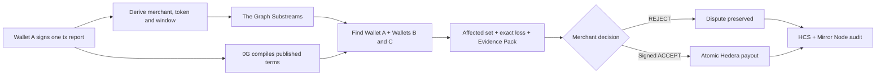

# BITEBACK

> When protocols bite, wallets bite back.

BITEBACK collapses a slow, fragmented dispute process into one verifiable
incident. Users stop chasing protocols one by one; protocols stop investigating
wallet by wallet, reconciling transfers and calculating losses manually. From
one disputed payment, BITEBACK finds every affected wallet, calculates the exact
collective loss and packages one case to contest or settle.

**One report. Every affected wallet. One case to resolve.**


## Judge path

| Question | Verifiable answer |
|---|---|
| Does it work? | `npm run check` builds the service and runs the deterministic, security, anomaly, and settlement tests |
| Is it live? | One public testnet run links the reported Base transaction, Graph fan-out, HCS audit, 0G evidence hash, and atomic Hedera payout below |
| What is novel? | One wallet report expands into one collective case; an independent Bayesian monitor warns wallets before deterministic evidence exists |
| Can AI or an anomaly move funds? | No. Only Graph-derived violations, wallet claims, frozen evidence, and a merchant-signed `ACCEPT` can unlock settlement |
| Was the anomaly model audited? | A resumable one-year Base, Optimism, and Arbitrum pipeline compares v1, seasonal MAD, and conformal v2; it publishes no result until exact coverage passes |

For the copy-ready description, three-minute video script, live-demo sequence,
and final checklist, see [SUBMISSION.md](./SUBMISSION.md).

## One incident instead of hundreds of tickets

| Fragmented process | BITEBACK |
|---|---|
| Every user discovers the issue and chases the protocol separately | One report triggers the collective search |
| The protocol investigates and reconciles wallets one at a time | One deterministic affected-wallet set |
| Losses and compensation are calculated case by case | One exact collective loss and one Evidence Pack |
| Resolution is repeated for every claimant | One case to contest or authorize; Hedera pays everyone atomically after approval |

## Two paths, one engine

| | **Dispute path — launch wedge** | **Integrated path — merchant upgrade** |
|---|---|---|
| Trigger | One user identifies a disputed payment | Merchant opts in before any incident |
| Policy | Candidate rule compiled from the merchant's published terms, with URL and rule hash | Merchant signs the exact rule hash |
| Result | One affected-wallet set, exact collective loss and Evidence Pack | The same case with pre-authorized automatic payout |
| Merchant action | Review one aggregated case, then sign `ACCEPT` or `REJECT` | Consent exists before the incident |
| Hard limit | No published billing policy means no deterministic incident | Requires a funded bond and active allowance |

The go-to-market starts with disputes because a new protocol cannot assume
merchant adoption. One complaint supplies attention; BITEBACK supplies the
fan-out that an individual cannot produce. Public status is created only when
the deterministic detector finds violations, and an unsigned compiled rule is
presented as BITEBACK's contestable interpretation of the cited terms—not as an
admitted fact. The prototype scopes each scan by merchant, token, window and
`ruleHash`; production still requires persistent caching and rate limits.
Verified settlement changes the factual status; it does not erase the incident.

The hackathon demo exercises the dispute path end to end. Wallet A signs one
reported transaction before any scan exists; only then does The Graph reveal
the two additional affected wallets. Evidence freezes, the merchant explicitly
authorizes that exact case, and only then can Hedera settle it atomically. A
public merchant-resolution page remains future product surface.

## What is implemented

| Stage | Live implementation |
|---|---|
| Policy | 0G Compute compiles published terms into strict JSON with provenance; the rule can open a dispute but cannot move funds |
| Trigger | One wallet signs `BITEBACK_REPORT_V1` over one confirmed transaction hash; merchant, token and window are derived from its receipt |
| Detection | Only after that report, The Graph Substreams indexes the merchant scope and the Victim Finder MCP derives every violation |
| Anomaly monitoring | An independent Bayesian monitor learns 5-minute EVM chain-health baselines and emits non-financial alerts |
| Claims | Every affected EVM wallet signs one short-lived EIP-191 delegation naming its Hedera payout account |
| Evidence | Canonical evidence is SHA-256 hashed, uploaded to 0G Storage, downloaded, verified and anchored on HCS |
| Decision | After evidence freezes, the merchant signs `ACCEPT` or `REJECT` over the incident, evidence hash and exact total |
| Settlement | Only `ACCEPT` unlocks one approved HBAR debit and N recipient credits atomically |
| Audit | HCS stores deduplicated, hash-chained envelopes; Mirror Node serves the public timeline |

The model only compiles the policy. It never receives payments, determines
victims, calculates compensation, or chooses recipients. Those operations are
deterministic.

## Why every integration is load-bearing

| Partner | Required role in BITEBACK | Failure behavior |
|---|---|---|
| **0G Compute** | Converts published provider terms into the strict dispute rule | No new policy can be compiled |
| **The Graph** | Supplies the canonical transfer set from which affected wallets are derived | No incident can be opened |
| **0G Storage** | Preserves the complete canonical Evidence Pack outside the HCS message limit | Settlement fails closed |
| **Hedera** | Verifies the decision trail, executes the merchant-authorized atomic payout, and publishes the audit | No compensation is sent |

The integrations are sequential trust boundaries, not logos added to the same
screen. A payout cannot happen unless all four live checks succeed.

## Live demo: the dispute path

ByteMeter API is a controlled provider selling a fixed-price three-query
data-enrichment pack for `0.001` test USDC. Its published policy allows
one equal charge per wallet per UTC day. Clicking **Create live charges**:

1. creates three fresh customer wallets;
2. submits three valid pack charges to Base Sepolia;
3. submits a second equal charge four seconds later;
4. stops with six confirmed charges, zero incidents and zero Graph results;
5. after **Report Wallet A charge**, Wallet A signs one transaction hash;
6. derives merchant, token and window from that transaction, then asks The
   Graph to find the full pattern—one reporter becomes three affected wallets;
7. preserves the signed report inside the Evidence Pack, collects real EIP-191
   recipient authorizations and archives the evidence in
   0G;
8. stops at **Merchant decision required**;
9. after the operator clicks **Authorize settlement**, records a signed
   ByteMeter `ACCEPT` and executes a new atomic Hedera payout.

The demo does not allege misconduct by an external company or infer payment
intent from equal transfers alone.

## Manual settlement authorization

Freezing evidence never moves money. For the launch path:

1. the merchant reviews the compiled rule, affected set and total;
2. it signs `ACCEPT` over the incident ID, evidence hash and exact payout;
3. the Settlement Agent revalidates source receipts, 0G bytes, claims, reserve,
   allowance and replay set;
4. Hedera executes one atomic payout and HCS records the authorization and
   result.

`REJECT` closes the incident without payment and preserves the counter-position
in the audit trail.



## Stack

- The Graph: live transfer indexing and MCP-backed victim discovery.
- 0G: inference for policy compilation and durable evidence storage.
- Hedera: settlement reserve, native allowance, merchant-authorized atomic HBAR
  payout, HCS, and Mirror Node.
- Hono, TypeScript, ethers, and the official partner SDKs.

## Partner-track alignment

### The Graph — Best AI Tooling

The **Victim Finder MCP** is independently callable by MCP clients and exposes
four typed tools:

- `scanViolations` queries live Substreams data and applies the compiled rule;
- `findVictims` returns the affected-wallet set derived from that data;
- `calculateLoss` recalculates losses server-side;
- `buildEvidencePack` returns canonical evidence and its SHA-256.

The Graph is also the application's load-bearing live data source. Pure fixtures
cannot enter the settlement path.

### Hedera — AI & Agentic Payments

The provider explicitly authorizes one frozen settlement by signing `ACCEPT`.
The Settlement Agent then determines recipients from the Graph-derived evidence,
recalculates every amount and submits one atomic payout. The human authorizes
the case; the agent safely executes its exact multi-recipient resolution.

### Hedera — No Solidity Allowed

BITEBACK uses only native Hedera services through `@hashgraph/sdk`:

- Crypto Service for accounts, HBAR allowance, and one atomic N-recipient
  transfer;
- Hedera Consensus Service for the ordered audit chain;
- Mirror Node for public allowance, transaction, and audit verification.

This repository contains no Solidity and deploys no smart contracts.

### 0G — Best AI Product

0G Compute translates natural-language billing terms into a strict, contestable
candidate rule. The model writes only the rule. 0G Storage holds the canonical
Evidence Pack, which BITEBACK downloads and verifies before a merchant can
authorize settlement.

## Quickstart

Requirements:

- Node.js 22+;
- Pinax JWT;
- funded Hedera Testnet operator;
- funded 0G Storage wallet;
- 0G Compute router URL and key;
- Base Sepolia ETH and test USDC for the generated merchant wallet.

```bash
npm install
cp .env.example .env
# Fill PINAX_JWT, HEDERA_ACCOUNT_ID, HEDERA_PRIVATE_KEY,
# OG_PRIVATE_KEY, OG_ROUTER_BASE and OG_ROUTER_KEY.
npm run setup:demo
```

`setup:demo` creates or reuses the Settlement Agent, a 101 HBAR settlement
reserve, 100 HBAR execution allowance, three Hedera recipients, merchant and
victim wallets, and a clean HCS topic. It writes `.env` with mode `0600` and
never prints private keys. It spends Hedera Testnet funds.

Set `RESET_HCS_TOPIC=1` before `setup:demo` to replace an older immutable topic;
the script resets the flag to `0` after creating the new chain.

Fund the printed merchant address with Base Sepolia ETH and test USDC. Then run
the complete deterministic flow:

```bash
npm run demo:mint
npm run dev
# In another terminal:
npm run demo:run
```

`demo:run` compiles the policy, signs Wallet A's transaction report, lets that
report trigger The Graph, joins every affected wallet,
verifies the 0G round-trip, signs an explicit test `ACCEPT`, and settles through
Hedera. The dashboard exposes the same authorization as a separate manual
button. Open [http://localhost:8403](http://localhost:8403) to run it.

## On-chain anomaly monitoring

Anomaly monitoring is independent from disputes and settlement. It can warn
operators, but cannot create an incident, claim, decision or payout.

Set `ANOMALY_ENABLED=1` and configure EVM networks in
`ANOMALY_CHAINS_JSON`. Each entry requires `id`, `name`, `chainId`, `rpcUrl`
and `confirmations`; `substreamsEndpoint` enables the bundled compact
Substreams package, with confirmed-block JSON-RPC as fallback. An optional
`secondaryRpcUrl` supplies the independent finalized-head quorum required
before a liveness stall can become a critical chain alert. Provider disagreement
is source degradation, never a chain anomaly. The monitor
backfills 30 days in resumable 50,000-block Substreams chunks or 500-block RPC
chunks, stores 5-minute buckets, then runs every minute.

The independent heartbeat checks every configured chain each minute and reports
both finalized heads, quorum, block age, RPC latency, and consecutive failures.
A block older than `ANOMALY_HEARTBEAT_STALE_SECONDS` is `stalled` only when both
providers agree; two consecutive primary heartbeat failures are `down`.
Backfills do not block heartbeat checks.

The candidate v2 detector uses a robust empirical-Bayes
Normal–Inverse-Gamma posterior, weekday/weekend five-minute seasonality,
conformal residual calibration, and Benjamini–Yekutieli correction across
correlated metrics. Positive values use `log1p`; ratios use a clamped logit
transform. The service retains v1 until a complete benchmark artifact promotes
v2 and its frozen parameters. Abnormal buckets are quarantined until an
operator resolves them as expected or confirmed.

Alerts appear in the dashboard and may be acknowledged or resolved as
`expected` or `confirmed`. When `ANOMALY_WEBHOOK_URL` and
`ANOMALY_WEBHOOK_SECRET` are set, webhook bodies are HMAC-SHA256 signed over
`timestamp.rawBody`.

Wallets can sign a non-financial watch message to receive chain warnings.
Anomaly assessments suggest safe actions and expose dispute readiness, but a
collective dispute still requires one signed confirmed transaction report and
deterministic Graph-derived violations. See
[ANOMALY_VALIDATION.md](./ANOMALY_VALIDATION.md) for the frozen labels,
methodology, limitations, and reproducible annual benchmark.

### Validation dashboard

The Anomalies view is designed for direct model review:

- aligned Base, Optimism, and Arbitrum annual timelines distinguish official
  incident windows, observer simulations, warning scores, and critical scores;
- selectable event charts show the observed metric, expected mean, 99% and
  99.9% predictive bands, UTC boundaries, and the first detection;
- precision-recall is the primary rare-event comparison for v1, seasonal MAD,
  and conformal v2;
- the zoomed calibration plot makes small deviations near 99% and 99.9%
  coverage readable instead of compressing them into a chart corner;
- the research index maps every evaluation choice to its paper and concrete
  implementation.

The UI does not invent benchmark values. Annual charts appear only after
`npm run anomaly:benchmark` produces a checksum-verified artifact with complete
three-chain coverage.

## Commands

```text
npm run build            TypeScript build
npm test                 deterministic and delegation security tests
npm run check            build + tests
npm run setup:demo       provision testnet infrastructure
npm run demo:mint        create a fresh six-transfer Base Sepolia dataset
npm run demo:run         execute the complete end-to-end flow
npm run policy:sign      compile terms through 0G and sign with the merchant key
npm run claims:join      sign and submit every affected-wallet delegation
npm run evidence:verify  independent 0G upload/download/hash round-trip
ANOMALY_LIVE_TEST=1 npm test  opt-in configured Substreams smoke test
npm run anomaly:validate      replay labeled Base and Optimism incidents
npm run anomaly:benchmark     resume the one-year three-chain benchmark
npm run dev              local development server
```

## HTTP API

```text
GET  /api/health
GET  /api/config
GET  /api/bond
GET  /api/demo/live
POST /api/demo/live
POST /api/demo/live/report
POST /api/demo/live/authorize
POST /api/rules/compile
POST /api/rules/sign
POST /api/report
POST /api/scan
GET  /api/anomaly/chains
GET  /api/anomaly/heartbeat
GET  /api/anomaly/benchmark
GET  /api/anomaly/research
GET  /api/anomaly/chains/:id/metrics
GET  /api/anomalies
GET  /api/anomalies/:id
GET  /api/anomalies/:id/dispute-readiness
POST /api/anomaly/wallets/watch
GET  /api/anomaly/wallets/:address/notifications
POST /api/anomalies/run
POST /api/anomalies/:id/acknowledge
POST /api/anomalies/:id/resolve
GET  /api/incidents
GET  /api/incidents/:id
POST /api/incidents/:id/join
POST /api/incidents/:id/freeze
POST /api/incidents/:id/decision
POST /api/incidents/:id/settle
GET  /api/incidents/:id/evidence
GET  /api/incidents/:id/audit
POST /mcp
```

All mutations except signed wallet reporting and wallet claim joining require:

```text
Authorization: Bearer <OPERATOR_TOKEN>
```

`POST /api/incidents/:id/freeze` only freezes and archives evidence.
`POST /api/report` verifies `BITEBACK_REPORT_V1`, derives the scope from the
reported transaction and only then executes the collective Graph query.
`POST /api/incidents/:id/decision` records the merchant's signed `ACCEPT` or
`REJECT`. `POST /api/incidents/:id/settle` is idempotent and fails closed unless
the stored `ACCEPT` matches the frozen evidence and exact total.

The reporting wallet signs exactly:

```text
BITEBACK_REPORT_V1
txHash=0x...
```

```bash
curl -X POST http://localhost:8403/api/report \
  -H 'content-type: application/json' \
  -d '{"txHash":"0x...","signature":"0x..."}'
```

Example scan:

```bash
curl -X POST http://localhost:8403/api/scan \
  -H 'authorization: Bearer <OPERATOR_TOKEN>' \
  -H 'content-type: application/json' \
  -d '{"ruleId":"rule_max_daily_charge_v1"}'
```

List the MCP tools:

```bash
curl -X POST http://localhost:8403/mcp \
  -H 'authorization: Bearer <OPERATOR_TOKEN>' \
  -H 'content-type: application/json' \
  -H 'accept: application/json, text/event-stream' \
  -d '{"jsonrpc":"2.0","id":1,"method":"tools/list","params":{}}'
```

The MCP server exposes `scanViolations`, `findVictims`, `calculateLoss`, and
`buildEvidencePack`. Clients cannot submit payout amounts.

## Security invariants

- the complete compiled rule snapshot is bound into the evidence hash;
- only a post-evidence `ACCEPT` signed by `SOURCE_MERCHANT_SIGNER` can unlock
  settlement;
- the signed decision binds the incident ID, evidence hash, decision, exact
  payout, nonce and expiry;
- affected-wallet delegations are expiring, nonce-protected, and signer-bound;
- source receipts must still contain each exact transfer and meet the configured
  confirmation threshold;
- an excess payment ID can belong to only one incident and one settlement;
- `compensationBps`, daily allowance, and excess count determine payout exactly;
- canonical 0G bytes must round-trip to the frozen SHA-256 before payment;
- claims, recipients, totals, bond balance, and allowance are recalculated
  immediately before settlement;
- a Hedera transaction ID is persisted before submission and reconciled after an
  ambiguous outcome; an unknown result never creates a replacement transaction;
- HCS messages contain their payload, payload hash, dedupe key, and previous
  on-chain message hash in the current audit-envelope implementation;
- operator auth is fail-closed and JSON request bodies are capped at 32 KiB;
- private keys are never stored in incident data or returned by the HTTP API.

## Public testnet proof

- Settlement reserve: `0.0.9740041`
- Settlement Agent: `0.0.9735745`
- HCS topic:
  [0.0.9744276](https://testnet.mirrornode.hedera.com/api/v1/topics/0.0.9744276/messages?limit=20&order=asc)
- Wallet A trigger:
  [reported Base transaction](https://sepolia.basescan.org/tx/0x17093f2cc2a78d2f8cd6e2ce1ecda506cedf188c1de2ea1189a2bed56578c7e9),
  HCS `DISPUTE_REPORTED` sequence `41`
- The Graph fan-out: `1` signed reporter → `6` transfers → `3` affected
  wallets at indexed block `44623091`
- Atomic three-recipient payout:
  [SUCCESS](https://testnet.mirrornode.hedera.com/api/v1/transactions/0.0.9735745-1785014546-095681900)
- 0G Evidence Pack:
  `0xca67f68d05ea0c987b10246effaf25255a1eecc32d364205a689e5ecfd67c658`
- HCS merchant authorization: sequence `47`, event `SETTLEMENT_AUTHORIZED`
- HCS payout confirmation: sequence `49`, event `PAYOUT_CONFIRMED`
- Base Sepolia USDC: `0x036CbD53842c5426634e7929541eC2318f3dCF7e`

These identifiers belong to one coherent, publicly verifiable run.
`setup:demo` creates an independent HCS topic and controlled source dataset for
another end-to-end run.

## Honest limitations

- The dispute path requires a published billing policy. Without one, BITEBACK
  has no objective rule to compile and creates no deterministic incident.
- A rule compiled without merchant signature is BITEBACK's contestable
  interpretation of the cited policy. It must retain policy provenance and
  cannot authorize payment.
- A non-integrated merchant can ignore the evidence. BITEBACK can assemble an
  actionable collective case, but cannot compel payment or withdraw from an
  unrelated account.
- Automatic protection is a later integrated path: a merchant may pre-authorize
  signed rules and a Consumer Bond. It is not the launch flow demonstrated here.
- **Settlement idempotency lives in the local state file, not on-chain.** An
  incident that has already paid is refused a second time — but if `data/` is
  deleted, the same violation is detected again and paid again. We reproduced
  this during testing. A production deployment must reconcile against the HCS
  audit topic and Mirror Node before transferring, rather than trusting local
  state.
- Without a payment request ID, transfer intent is not provable. The detector
  measures charges above a compiled daily policy; it does not claim two equal
  transfers are inherently accidental.
- Source payments and HBAR compensation are cross-chain; there is no bridge or FX
  conversion.
- The controlled testnet dataset demonstrates the system and does not allege
  misconduct by an external merchant.
- BITEBACK proves control of eligible wallets, not unique human identity.
- A Hedera allowance is revocable authorization, not immutable escrow.

The detailed product plan and threat model are in [BLUEPRINT.md](./BLUEPRINT.md).

## License

MIT — see [LICENSE](./LICENSE).
