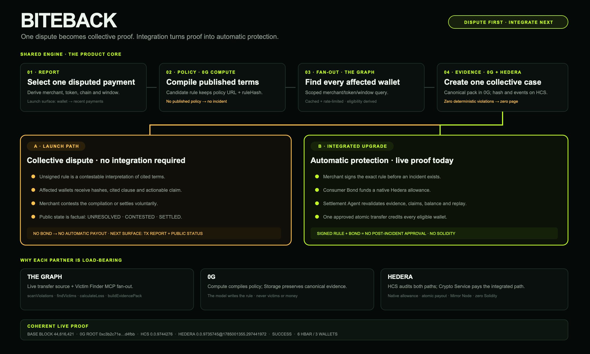
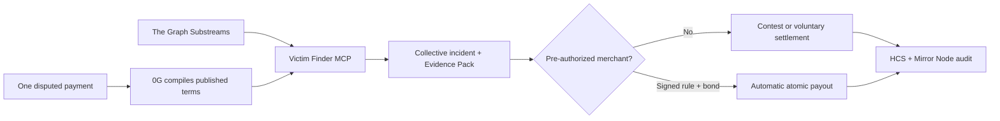

# BITEBACK

> When protocols bite, wallets bite back.

BITEBACK turns one on-chain billing dispute into collective, verifiable
evidence. 0G Compute compiles the merchant's published terms, The Graph finds
every wallet affected by the same deterministic violation, and 0G Storage plus
Hedera preserve the case. If the merchant later integrates, the same engine can
settle every eligible wallet automatically from a pre-authorized Consumer Bond.

**Dispute first. Integrated protection next. No Solidity.**



## Two paths, one engine

| | **Dispute path — launch wedge** | **Integrated path — merchant upgrade** |
|---|---|---|
| Trigger | One user identifies a disputed payment | Merchant opts in before any incident |
| Policy | Candidate rule compiled from the merchant's published terms, with URL and rule hash | Merchant signs the exact rule hash |
| Result | Affected-wallet set, Evidence Pack and factual amount unresolved | The same evidence plus automatic atomic payout |
| Merchant action | Contest the compilation or settle voluntarily | No post-incident approval; consent already exists |
| Hard limit | No published billing policy means no deterministic incident | Requires a funded bond and active allowance |

The go-to-market starts with disputes because a new protocol cannot assume
merchant adoption. One complaint supplies attention; BITEBACK supplies the
fan-out that an individual cannot produce. Public status is created only when
the deterministic detector finds violations, and an unsigned compiled rule is
presented as BITEBACK's contestable interpretation of the cited terms—not as an
admitted fact. Scans are scoped, cached and rate-limited by merchant, token,
window and `ruleHash`. Verified settlement changes the factual status; it does
not erase the incident.

The hackathon demo exercises the integrated path end to end to prove that the
shared engine can go beyond evidence and move value autonomously. The
user-facing transaction-report and public resolution flow remain the next
product surface; they are not presented as implemented in this repository.

## What is implemented

| Stage | Live implementation |
|---|---|
| Policy | 0G Compute compiles terms into strict JSON; candidates retain compilation provenance and can be signed by the allowlisted merchant |
| Detection | The Graph Substreams indexes Base Sepolia USDC transfers; the Victim Finder MCP derives violations |
| Claims | Every affected EVM wallet signs one short-lived EIP-191 delegation naming its Hedera payout account |
| Evidence | Canonical evidence is SHA-256 hashed, uploaded to 0G Storage, downloaded, verified and anchored on HCS |
| Contest | An unsigned incident can stop at evidence or record a signed merchant `REJECT`; no funds move |
| Settlement | A persisted Hedera transaction ID executes one approved HBAR debit and N recipient credits atomically |
| Audit | HCS stores deduplicated, hash-chained envelopes; Mirror Node serves the public timeline |

The model only compiles the policy. It never receives payments, determines
victims, calculates compensation, or chooses recipients. Those operations are
deterministic.

## Why every integration is load-bearing

| Partner | Required role in BITEBACK | Failure behavior |
|---|---|---|
| **0G Compute** | Converts provider terms into the strict rule the provider signs | No new policy can be registered |
| **The Graph** | Supplies the canonical transfer set from which affected wallets are derived | No incident can be opened |
| **0G Storage** | Preserves the complete canonical Evidence Pack outside the HCS message limit | Settlement fails closed |
| **Hedera** | Holds the pre-authorized bond, executes the atomic payout, and publishes the audit trail | No compensation is sent |

The integrations are sequential trust boundaries, not logos added to the same
screen. A payout cannot happen unless all four live checks succeed.

## Live demo: the integrated upgrade path

ByteMeter API is a controlled integrated provider selling a fixed-price
three-query data-enrichment pack for `0.001` test USDC. Its signed policy allows
one equal charge per wallet per UTC day. Clicking **Start live incident**:

1. creates three fresh customer wallets;
2. submits three valid pack charges to Base Sepolia;
3. submits a second equal charge four seconds later;
4. waits for The Graph Substreams to index all six transfers before classifying
   the three second charges as policy violations;
5. collects real EIP-191 recipient authorizations, archives the evidence in 0G,
   and executes a new atomic Hedera payout.

The scenario proves the technically stronger integrated outcome using a
controlled provider. The launch wedge remains dispute-first. The demo does not
allege misconduct by an external company or infer payment intent from equal
transfers alone.

## Autonomous consent model

An integrated merchant consents before an incident exists:

1. it signs the machine-readable rule;
2. it funds a Hedera Consumer Bond;
3. it grants the Settlement Agent a native HBAR allowance.

After every affected wallet joins, freezing the evidence triggers settlement
automatically. The service revalidates the signed rule, source-chain receipts and
confirmations, 0G bytes, claims, totals, bond balance, allowance, and replay set.
There is no later `ACCEPT` decision or payout button.



## Stack

- The Graph: live transfer indexing and MCP-backed victim discovery.
- 0G: inference for policy compilation and durable evidence storage.
- Hedera: Consumer Bond, native allowance, atomic HBAR payout, HCS, and Mirror
  Node.
- Hono, TypeScript, ethers, and the official partner SDKs.

## Partner-track alignment

### The Graph — Best AI Tooling

The **Victim Finder MCP** is independently callable by MCP clients and exposes
four typed tools:

- `scanViolations` queries live Substreams data and applies the compiled rule;
- `findVictims` returns the affected-wallet set derived from that data;
- `calculateLoss` recalculates losses server-side;
- `buildEvidencePack` returns canonical evidence and its SHA-256.

The Graph is also the application's load-bearing live data source. Pure fixtures
cannot enter the settlement path.

### Hedera — AI & Agentic Payments

The provider grants consent before any incident by signing its policy and
approving an HBAR allowance. After affected wallets have joined and evidence is
frozen, the Settlement Agent verifies every precondition and submits the payout
without a later `ACCEPT` decision. Evidence freeze is a technical state
transition, not a new payment approval.

### Hedera — No Solidity Allowed

BITEBACK uses only native Hedera services through `@hashgraph/sdk`:

- Crypto Service for accounts, HBAR allowance, and one atomic N-recipient
  transfer;
- Hedera Consensus Service for the ordered audit chain;
- Mirror Node for public allowance, transaction, and audit verification.

This repository contains no Solidity and deploys no smart contracts.

### 0G — Best AI Product

0G Compute translates natural-language billing terms into a strict candidate
rule. In the dispute path, the candidate stays explicitly unsigned and
contestable; in the integrated path, the provider signs its exact hash. In both
paths the model writes only the rule. 0G Storage holds the canonical Evidence
Pack, which BITEBACK downloads and verifies before any settlement.

## Quickstart

Requirements:

- Node.js 22+;
- Pinax JWT;
- funded Hedera Testnet operator;
- funded 0G Storage wallet;
- 0G Compute router URL and key;
- Base Sepolia ETH and test USDC for the generated merchant wallet.

```bash
npm install
cp .env.example .env
# Fill PINAX_JWT, HEDERA_ACCOUNT_ID, HEDERA_PRIVATE_KEY,
# OG_PRIVATE_KEY, OG_ROUTER_BASE and OG_ROUTER_KEY.
npm run setup:demo
```

`setup:demo` creates or reuses the Settlement Agent, 101 HBAR Consumer Bond,
100 HBAR allowance, three Hedera recipients, merchant and victim wallets, and a
clean HCS topic. It writes `.env` with mode `0600` and never prints private keys.
It spends Hedera Testnet funds.

Set `RESET_HCS_TOPIC=1` before `setup:demo` to replace an older immutable topic;
the script resets the flag to `0` after creating the new chain.

Fund the printed merchant address with Base Sepolia ETH and test USDC. Then run
the complete deterministic flow:

```bash
npm run demo:mint
npm run dev
# In another terminal:
npm run demo:run
```

`demo:run` compiles and signs the policy, scans The Graph, joins every affected
wallet, verifies the 0G round-trip and settles through Hedera. It is idempotent.
Open [http://localhost:8403](http://localhost:8403) to inspect the console or
start another controlled live incident.

## Commands

```text
npm run build            TypeScript build
npm test                 deterministic and delegation security tests
npm run check            build + tests
npm run setup:demo       provision testnet infrastructure
npm run demo:mint        create a fresh six-transfer Base Sepolia dataset
npm run demo:run         execute the complete end-to-end flow
npm run policy:sign      compile terms through 0G and sign with the merchant key
npm run claims:join      sign and submit every affected-wallet delegation
npm run evidence:verify  independent 0G upload/download/hash round-trip
npm run dev              local development server
```

## HTTP API

```text
GET  /api/health
GET  /api/config
GET  /api/bond
GET  /api/demo/live
POST /api/demo/live
POST /api/rules/compile
POST /api/rules/sign
POST /api/scan
GET  /api/incidents
GET  /api/incidents/:id
POST /api/incidents/:id/join
POST /api/incidents/:id/freeze
POST /api/incidents/:id/decision
POST /api/incidents/:id/settle
GET  /api/incidents/:id/evidence
GET  /api/incidents/:id/audit
POST /mcp
```

All mutation endpoints except wallet claim joining require:

```text
Authorization: Bearer <OPERATOR_TOKEN>
```

`POST /api/incidents/:id/settle` is an idempotent recovery/reconciliation
endpoint. Normal integrated settlement starts inside `freeze`.

Example scan:

```bash
curl -X POST http://localhost:8403/api/scan \
  -H 'authorization: Bearer <OPERATOR_TOKEN>' \
  -H 'content-type: application/json' \
  -d '{"ruleId":"rule_max_daily_charge_v1"}'
```

List the MCP tools:

```bash
curl -X POST http://localhost:8403/mcp \
  -H 'authorization: Bearer <OPERATOR_TOKEN>' \
  -H 'content-type: application/json' \
  -H 'accept: application/json, text/event-stream' \
  -d '{"jsonrpc":"2.0","id":1,"method":"tools/list","params":{}}'
```

The MCP server exposes `scanViolations`, `findVictims`, `calculateLoss`, and
`buildEvidencePack`. Clients cannot submit payout amounts.

## Security invariants

- merchant policy signatures recover to `SOURCE_MERCHANT_SIGNER`;
- the complete compiled rule snapshot is bound into the evidence hash;
- only a valid allowlisted merchant signature can unlock automatic settlement;
- affected-wallet delegations are expiring, nonce-protected, and signer-bound;
- source receipts must still contain each exact transfer and meet the configured
  confirmation threshold;
- an excess payment ID can belong to only one incident and one settlement;
- `compensationBps`, daily allowance, and excess count determine payout exactly;
- canonical 0G bytes must round-trip to the frozen SHA-256 before payment;
- claims, recipients, totals, bond balance, and allowance are recalculated
  immediately before settlement;
- a Hedera transaction ID is persisted before submission and reconciled after an
  ambiguous outcome; an unknown result never creates a replacement transaction;
- HCS messages contain their payload, payload hash, dedupe key, and previous
  on-chain message hash in the current audit-envelope implementation;
- operator auth is fail-closed and JSON request bodies are capped at 32 KiB;
- private keys are never stored in incident data or returned by the HTTP API.

## Public testnet proof

- Consumer Bond: `0.0.9740041`
- Settlement Agent: `0.0.9735745`
- HCS topic:
  [0.0.9744276](https://testnet.mirrornode.hedera.com/api/v1/topics/0.0.9744276/messages?limit=20&order=asc)
- Atomic three-recipient payout:
  [SUCCESS](https://testnet.mirrornode.hedera.com/api/v1/transactions/0.0.9735745-1785001355-297441972)
- 0G Evidence Pack:
  `0xc3b2c71e62346510576e79f0367d342e17c64f05c552dc63f34c45ebf60d4fbb`
- The Graph indexed block: `44616421`
- Base Sepolia USDC: `0x036CbD53842c5426634e7929541eC2318f3dCF7e`

These identifiers belong to one coherent, publicly verifiable run.
`setup:demo` creates an independent HCS topic and controlled source dataset for
another end-to-end run.

## Honest limitations

- The dispute path requires a published billing policy. Without one, BITEBACK
  has no objective rule to compile and creates no deterministic incident.
- A rule compiled without merchant signature is BITEBACK's contestable
  interpretation of the cited policy. It must retain policy provenance and
  cannot authorize payment.
- A non-integrated merchant can ignore the evidence. BITEBACK can assemble an
  actionable collective case, but cannot compel payment or withdraw from an
  unrelated account.
- Automatic protection is the later integrated path: the merchant must sign the
  rule, fund the bond and keep the allowance active.
- **Settlement idempotency lives in the local state file, not on-chain.** An
  incident that has already paid is refused a second time — but if `data/` is
  deleted, the same violation is detected again and paid again. We reproduced
  this during testing. A production deployment must reconcile against the HCS
  audit topic and Mirror Node before transferring, rather than trusting local
  state.
- Without a payment request ID, transfer intent is not provable. The detector
  measures charges above a compiled daily policy; it does not claim two equal
  transfers are inherently accidental.
- Source payments and HBAR compensation are cross-chain; there is no bridge or FX
  conversion.
- The controlled testnet dataset demonstrates the system and does not allege
  misconduct by an external merchant.
- BITEBACK proves control of eligible wallets, not unique human identity.
- A Hedera allowance is revocable authorization, not immutable escrow.

The detailed product plan and threat model are in [BLUEPRINT.md](./BLUEPRINT.md).

## License

MIT — see [LICENSE](./LICENSE).
