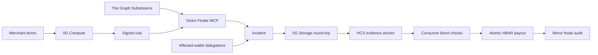

# BITEBACK

> When protocols bite, wallets bite back.

BITEBACK is an autonomous consumer-protection layer for crypto. 0G Compute turns
a merchant's published terms into a signed deterministic rule, The Graph finds
wallets charged above that rule, and Hedera compensates every affected wallet
atomically from a pre-authorized Consumer Bond.

**No Solidity. No post-incident merchant approval. Deterministic settlement.**


## What is implemented

| Stage | Live implementation |
|---|---|
| Policy | 0G Compute compiles terms into strict JSON; the allowlisted merchant signs the exact rule hash |
| Detection | The Graph Substreams indexes Base Sepolia USDC transfers; the Victim Finder MCP derives violations |
| Claims | Every affected EVM wallet signs one short-lived EIP-191 delegation naming its Hedera payout account |
| Evidence | Canonical evidence is SHA-256 hashed, uploaded to 0G Storage, downloaded, and verified before settlement |
| Settlement | A persisted Hedera transaction ID executes one approved HBAR debit and N recipient credits atomically |
| Audit | HCS stores deduplicated, hash-chained envelopes; Mirror Node serves the public timeline |

The model only compiles the policy. It never receives payments, determines
victims, calculates compensation, or chooses recipients. Those operations are
deterministic.

## Why every integration is load-bearing

| Partner | Required role in BITEBACK | Failure behavior |
|---|---|---|
| **0G Compute** | Converts provider terms into the strict rule the provider signs | No new policy can be registered |
| **The Graph** | Supplies the canonical transfer set from which affected wallets are derived | No incident can be opened |
| **0G Storage** | Preserves the complete canonical Evidence Pack outside the HCS message limit | Settlement fails closed |
| **Hedera** | Holds the pre-authorized bond, executes the atomic payout, and publishes the audit trail | No compensation is sent |

The integrations are sequential trust boundaries, not logos added to the same
screen. A payout cannot happen unless all four live checks succeed.

## Live demo scenario

ByteMeter API is a controlled integrated provider selling a fixed-price
three-query data-enrichment pack for `0.001` test USDC. Its signed policy allows
one equal charge per wallet per UTC day. Clicking **Start live incident**:

1. creates three fresh customer wallets;
2. submits three valid pack charges to Base Sepolia;
3. submits a second equal charge four seconds later;
4. waits for The Graph Substreams to index all six transfers before classifying
   the three second charges as policy violations;
5. collects real EIP-191 recipient authorizations, archives the evidence in 0G,
   and executes a new atomic Hedera payout.

The scenario demonstrates a policy violation by a controlled provider. It does
not allege misconduct by an external company or infer payment intent from equal
transfers alone.

## Autonomous consent model

An integrated merchant consents before an incident exists:

1. it signs the machine-readable rule;
2. it funds a Hedera Consumer Bond;
3. it grants the Settlement Agent a native HBAR allowance.

After every affected wallet joins, freezing the evidence triggers settlement
automatically. The service revalidates the signed rule, source-chain receipts and
confirmations, 0G bytes, claims, totals, bond balance, allowance, and replay set.
There is no later `ACCEPT` decision or payout button.



## Stack

- The Graph: live transfer indexing and MCP-backed victim discovery.
- 0G: inference for policy compilation and durable evidence storage.
- Hedera: Consumer Bond, native allowance, atomic HBAR payout, HCS, and Mirror
  Node.
- Hono, TypeScript, ethers, and the official partner SDKs.

## Partner-track alignment

### The Graph — Best AI Tooling

The **Victim Finder MCP** is independently callable by MCP clients and exposes
four typed tools:

- `scanViolations` queries live Substreams data and applies a signed rule;
- `findVictims` returns the affected-wallet set derived from that data;
- `calculateLoss` recalculates losses server-side;
- `buildEvidencePack` returns canonical evidence and its SHA-256.

The Graph is also the application's load-bearing live data source. Pure fixtures
cannot enter the settlement path.

### Hedera — AI & Agentic Payments

The provider grants consent before any incident by signing its policy and
approving an HBAR allowance. After affected wallets have joined and evidence is
frozen, the Settlement Agent verifies every precondition and submits the payout
without a later `ACCEPT` decision. Evidence freeze is a technical state
transition, not a new payment approval.

### Hedera — No Solidity Allowed

BITEBACK uses only native Hedera services through `@hashgraph/sdk`:

- Crypto Service for accounts, HBAR allowance, and one atomic N-recipient
  transfer;
- Hedera Consensus Service for the ordered audit chain;
- Mirror Node for public allowance, transaction, and audit verification.

This repository contains no Solidity and deploys no smart contracts.

### 0G — Best AI Product

0G Compute translates natural-language billing terms into a strict candidate
rule. The provider signs the exact candidate hash, bounding the AI to policy
authoring. 0G Storage then holds the full canonical Evidence Pack; BITEBACK
downloads it and verifies its SHA-256 before Hedera settlement.

## Quickstart

Requirements:

- Node.js 22+;
- Pinax JWT;
- funded Hedera Testnet operator;
- funded 0G Storage wallet;
- 0G Compute router URL and key;
- Base Sepolia ETH and test USDC for the generated merchant wallet.

```bash
npm install
cp .env.example .env
# Fill PINAX_JWT, HEDERA_ACCOUNT_ID, HEDERA_PRIVATE_KEY,
# OG_PRIVATE_KEY, OG_ROUTER_BASE and OG_ROUTER_KEY.
npm run setup:demo
```

`setup:demo` creates or reuses the Settlement Agent, 101 HBAR Consumer Bond,
100 HBAR allowance, three Hedera recipients, merchant and victim wallets, and a
clean HCS topic. It writes `.env` with mode `0600` and never prints private keys.
It spends Hedera Testnet funds.

Set `RESET_HCS_TOPIC=1` before `setup:demo` to replace an older immutable topic;
the script resets the flag to `0` after creating the new chain.

Fund the printed merchant address with Base Sepolia ETH and test USDC, then:

```bash
npm run demo:mint
npm run dev
```

In another terminal, while the server is running:

```bash
npm run policy:sign
OPERATOR_TOKEN="$(node --env-file=.env -p 'process.env.OPERATOR_TOKEN')"
curl -sS -X POST http://localhost:8403/api/scan \
  -H "Authorization: Bearer $OPERATOR_TOKEN" \
  -H "Content-Type: application/json" \
  -d '{}'
npm run claims:join
INCIDENT_ID="$(curl -sS http://localhost:8403/api/incidents | node -p \
  'JSON.parse(require("node:fs").readFileSync(0, "utf8")).incidents[0].id')"
curl -sS -X POST "http://localhost:8403/api/incidents/$INCIDENT_ID/freeze" \
  -H "Authorization: Bearer $OPERATOR_TOKEN"
```

The freeze endpoint verifies the upload, HCS chain, source finality, claims,
totals, bond, allowance, and replay set before running the atomic payout. Open
[http://localhost:8403](http://localhost:8403), paste `OPERATOR_TOKEN`, and click
**Run verified replay** to inspect the settled proof through fresh partner reads.

The dashboard also exposes the complete 0G Compute → merchant-wallet signature
flow. `policy:sign` is the reproducible CLI equivalent; the server never signs on
the merchant's behalf.

## Commands

```text
npm run build            TypeScript build
npm test                 deterministic and delegation security tests
npm run check            build + tests
npm run setup:demo       provision testnet infrastructure
npm run demo:mint        create a fresh six-transfer Base Sepolia dataset
npm run policy:sign      compile terms through 0G and sign with the merchant key
npm run claims:join      sign and submit every affected-wallet delegation
npm run evidence:verify  independent 0G upload/download/hash round-trip
npm run dev              local development server
```

## HTTP API

```text
GET  /api/health
GET  /api/config
GET  /api/bond
GET  /api/demo/live
POST /api/demo/live
POST /api/rules/compile
POST /api/rules/sign
POST /api/scan
GET  /api/incidents
GET  /api/incidents/:id
POST /api/incidents/:id/join
POST /api/incidents/:id/freeze
POST /api/incidents/:id/decision
POST /api/incidents/:id/settle
GET  /api/incidents/:id/evidence
GET  /api/incidents/:id/audit
POST /mcp
```

All mutation endpoints except wallet claim joining require:

```text
Authorization: Bearer <OPERATOR_TOKEN>
```

`POST /api/incidents/:id/settle` is an idempotent recovery/reconciliation
endpoint. Normal integrated settlement starts inside `freeze`.

Example scan:

```bash
curl -X POST http://localhost:8403/api/scan \
  -H 'authorization: Bearer <OPERATOR_TOKEN>' \
  -H 'content-type: application/json' \
  -d '{"ruleId":"rule_max_daily_charge_v1"}'
```

List the MCP tools:

```bash
curl -X POST http://localhost:8403/mcp \
  -H 'authorization: Bearer <OPERATOR_TOKEN>' \
  -H 'content-type: application/json' \
  -H 'accept: application/json, text/event-stream' \
  -d '{"jsonrpc":"2.0","id":1,"method":"tools/list","params":{}}'
```

The MCP server exposes `scanViolations`, `findVictims`, `calculateLoss`, and
`buildEvidencePack`. Clients cannot submit payout amounts.

## Security invariants

- merchant policy signatures recover to `SOURCE_MERCHANT_SIGNER`;
- the complete signed rule snapshot is bound into the evidence hash;
- affected-wallet delegations are expiring, nonce-protected, and signer-bound;
- source receipts must still contain each exact transfer and meet the configured
  confirmation threshold;
- an excess payment ID can belong to only one incident and one settlement;
- `compensationBps`, daily allowance, and excess count determine payout exactly;
- canonical 0G bytes must round-trip to the frozen SHA-256 before payment;
- claims, recipients, totals, bond balance, and allowance are recalculated
  immediately before settlement;
- a Hedera transaction ID is persisted before submission and reconciled after an
  ambiguous outcome; an unknown result never creates a replacement transaction;
- HCS messages contain their payload, payload hash, dedupe key, and previous
  on-chain message hash in the current audit-envelope implementation;
- operator auth is fail-closed and JSON request bodies are capped at 32 KiB;
- private keys are never stored in incident data or returned by the HTTP API.

## Public testnet proof

- Consumer Bond: `0.0.9740041`
- Settlement Agent: `0.0.9735745`
- HCS topic: [0.0.9740519](https://hashscan.io/testnet/topic/0.0.9740519)
- Atomic three-recipient payout:
  [SUCCESS](https://hashscan.io/testnet/transaction/0.0.9735745%401784975329.901541450)
- 0G Evidence Pack:
  `0xa1f4031f0ab3064764501a5f29976ed9f2d8de4de353abe625eebe230d6f78fb`
- Base Sepolia USDC: `0x036CbD53842c5426634e7929541eC2318f3dCF7e`

These are the last public fixture objects. `setup:demo` creates a clean,
independent HCS topic and fresh controlled source dataset for a new end-to-end
run.

## Honest limitations

- Protection requires a merchant to opt in, fund the bond, sign the policy, and
  keep the allowance active. BITEBACK cannot withdraw from an unrelated account.
- Without a payment request ID, transfer intent is not provable. The MVP measures
  charges above the merchant's signed daily policy; it does not claim two equal
  transfers are inherently accidental.
- Source payments and HBAR compensation are cross-chain; there is no bridge or FX
  conversion.
- The controlled testnet dataset demonstrates the system and does not allege
  misconduct by an external merchant.
- BITEBACK proves control of eligible wallets, not unique human identity.
- A Hedera allowance is revocable authorization, not immutable escrow.

The detailed product plan and threat model are in [BLUEPRINT.md](./BLUEPRINT.md).

## License

MIT — see [LICENSE](./LICENSE).
